# MunchGo IaC — Monolith to Microservices on AWS

This is the **Infrastructure as Code (IaC) repository** for deploying the modernized **MunchGo food-delivery application** on AWS. The [MunchGo monolith](https://github.com/shanaka-versent/munchgo-monolith) has been decomposed into [6 Spring Boot microservices](https://github.com/shanaka-versent/munchgo-microservices) (auth, consumer, restaurant, order, courier, saga-orchestrator) with a [React SPA](https://github.com/shanaka-versent/munchgo-spa) replacing the Thymeleaf frontend. This repo contains the Terraform modules, Kubernetes manifests, ArgoCD applications, Kong gateway configuration, and automation scripts to provision and wire everything together.

**Microservices** run on **Amazon EKS** with **Istio Ambient Mesh** for automatic mTLS and L7 authorization — no sidecars. APIs are exposed through **Kong Dedicated Cloud Gateway** (fully managed in Kong's AWS account, connected via Transit Gateway) and protected by **Amazon CloudFront + WAF** with origin mTLS. Authentication is handled by **Amazon Cognito** (OIDC) validated at the Kong gateway layer — microservices receive pre-validated identity headers with zero token logic.

**The SPA** is deployed to **Amazon S3** and served securely through the same **CloudFront distribution** with WAF protection — hashed assets get immutable caching while `index.html` is always fresh.

The underlying platform pattern — Kong Cloud Gateway, EKS, Istio Gateway API, Transit Gateway private networking, CloudFront + WAF, and the full deployment automation — is documented in the [Kong Dedicated Cloud Gateway on EKS with Istio Gateway API (Ambient Mesh)](https://github.com/shanaka-versent/Kong-Konnect-Cloud-Gateway-on-EKS) branch. **This README focuses on what's built on top**: the MunchGo application, Cognito authentication, event-driven sagas, and the CI/CD pipelines.

---

## Table of Contents

- [Architecture](#architecture)
  - [Istio Ambient Service Mesh](#istio-ambient-service-mesh)
  - [East-West Traffic](#east-west-traffic--how-services-communicate)
- [MunchGo Microservices](#munchgo-microservices)
  - [Authentication — Amazon Cognito + OIDC](#authentication--amazon-cognito--oidc)
  - [Order Saga Flow](#order-saga-flow)
  - [MunchGo React SPA](#munchgo-react-spa)
- [Repository Structure](#repository-structure)
- [GitOps Pipeline](#gitops-pipeline)
- [Prerequisites](#prerequisites)
- [Deployment](#deployment)
- [Verification](#verification)
- [Observability](#observability)
- [Konnect UI](#konnect-ui)
- [Teardown](#teardown)
- [Appendix](#appendix)

---

## Architecture

### High-Level Overview

Two AWS accounts are involved. Traffic never touches the public internet between Kong and EKS. MunchGo microservices communicate east-west via Istio Ambient mTLS and north-south through Kong Cloud Gateway.

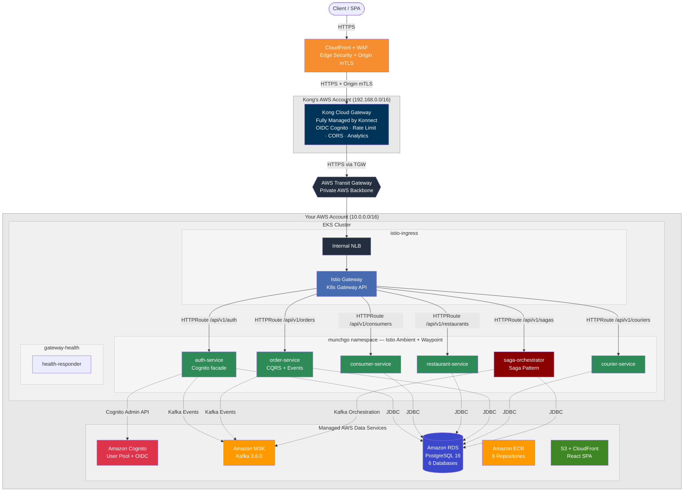
```mermaid
graph TB
    Client([Client / SPA])
    CF["CloudFront + WAF<br/>Edge Security + Origin mTLS"]

    subgraph kong_acct ["Kong's AWS Account (192.168.0.0/16)"]
        Kong["Kong Cloud Gateway<br/>Fully Managed by Konnect<br/>OIDC Cognito · Rate Limit · CORS · Analytics"]
    end

    TGW{{"AWS Transit Gateway<br/>Private AWS Backbone"}}

    subgraph your_acct ["Your AWS Account (10.0.0.0/16)"]
        subgraph eks_cluster [EKS Cluster]
            subgraph ns_istio_ing [istio-ingress]
                NLB[Internal NLB]
                IGW["Istio Gateway<br/>K8s Gateway API"]
            end
            subgraph ns_munchgo [munchgo namespace — Istio Ambient + Waypoint]
                AUTH["auth-service<br/>Cognito facade"]
                CONSUMER[consumer-service]
                RESTAURANT[restaurant-service]
                ORDER["order-service<br/>CQRS + Events"]
                COURIER[courier-service]
                SAGA["saga-orchestrator<br/>Saga Pattern"]
            end
            subgraph ns_gw_health [gateway-health]
                Health[health-responder]
            end
        end
        subgraph data_services [Managed AWS Data Services]
            COGNITO["Amazon Cognito<br/>User Pool + OIDC"]
            MSK["Amazon MSK<br/>Kafka 3.6.0"]
            RDS[("Amazon RDS<br/>PostgreSQL 16<br/>6 Databases")]
            ECR["Amazon ECR<br/>6 Repositories"]
            S3["S3 + CloudFront<br/>React SPA"]
        end
    end

    Client -->|HTTPS| CF
    CF -->|HTTPS + Origin mTLS| Kong
    Kong -->|HTTPS via TGW| TGW
    TGW --> NLB
    NLB --> IGW
    IGW -->|HTTPRoute /api/v1/auth| AUTH
    IGW -->|HTTPRoute /api/v1/consumers| CONSUMER
    IGW -->|HTTPRoute /api/v1/restaurants| RESTAURANT
    IGW -->|HTTPRoute /api/v1/orders| ORDER
    IGW -->|HTTPRoute /api/v1/couriers| COURIER
    IGW -->|HTTPRoute /api/v1/sagas| SAGA

    AUTH -.->|Cognito Admin API| COGNITO
    AUTH -.->|Kafka Events| MSK
    ORDER -.->|Kafka Events| MSK
    SAGA -.->|Kafka Orchestration| MSK
    AUTH -.->|JDBC| RDS
    CONSUMER -.->|JDBC| RDS
    RESTAURANT -.->|JDBC| RDS
    ORDER -.->|JDBC| RDS
    COURIER -.->|JDBC| RDS
    SAGA -.->|JDBC| RDS

    style Kong fill:#003459,color:#fff
    style IGW fill:#466BB0,color:#fff
    style CF fill:#F68D2E,color:#fff
    style TGW fill:#232F3E,color:#fff
    style NLB fill:#232F3E,color:#fff
    style MSK fill:#FF9900,color:#fff
    style RDS fill:#3B48CC,color:#fff
    style ECR fill:#FF9900,color:#fff
    style COGNITO fill:#DD344C,color:#fff
    style S3 fill:#3F8624,color:#fff
    style AUTH fill:#2E8B57,color:#fff
    style CONSUMER fill:#2E8B57,color:#fff
    style RESTAURANT fill:#2E8B57,color:#fff
    style ORDER fill:#2E8B57,color:#fff
    style COURIER fill:#2E8B57,color:#fff
    style SAGA fill:#8B0000,color:#fff
    style kong_acct fill:#E8E8E8,stroke:#999,color:#333
    style your_acct fill:#E8E8E8,stroke:#999,color:#333
    style eks_cluster fill:#F0F0F0,stroke:#BBB,color:#333
    style data_services fill:#F0F0F0,stroke:#BBB,color:#333
    style ns_istio_ing fill:#F5F5F5,stroke:#CCC,color:#333
    style ns_munchgo fill:#F5F5F5,stroke:#CCC,color:#333
    style ns_gw_health fill:#F5F5F5,stroke:#CCC,color:#333
```

### End-to-End Encryption

TLS terminates and re-encrypts at each trust boundary. Traffic is encrypted at every hop.

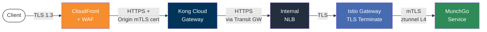
```mermaid
graph LR
    C([Client]) -->|"TLS 1.3"| CF
    CF["CloudFront<br/>+ WAF"] -->|"HTTPS +<br/>Origin mTLS cert"| Kong
    Kong["Kong Cloud<br/>Gateway"] -->|"HTTPS<br/>via Transit GW"| NLB["Internal<br/>NLB"]
    NLB -->|"TLS"| IGW["Istio Gateway<br/>TLS Terminate"]
    IGW -->|"mTLS<br/>ztunnel L4"| Pod["MunchGo<br/>Service"]

    style C fill:#fff,stroke:#333,color:#333
    style CF fill:#F68D2E,color:#fff
    style Kong fill:#003459,color:#fff
    style NLB fill:#232F3E,color:#fff
    style IGW fill:#466BB0,color:#fff
    style Pod fill:#2E8B57,color:#fff
```

| Hop | Protocol | Encryption | Terminates At |
|-----|----------|-----------|---------------|
| Client → CloudFront | HTTPS | TLS 1.2/1.3 (AWS-managed cert) | CloudFront edge |
| CloudFront → Kong | HTTPS | TLS + Origin mTLS client certificate | Kong Cloud Gateway |
| Kong → NLB (via TGW) | HTTPS | TLS (private AWS backbone via Transit GW) | Istio Gateway |
| NLB → Istio Gateway | TLS | TLS passthrough (NLB L4) | Istio Gateway (port 443) |
| Istio Gateway → Pod | HTTP | Istio Ambient mTLS (ztunnel L4) | Backend pod |

### Traffic Flow

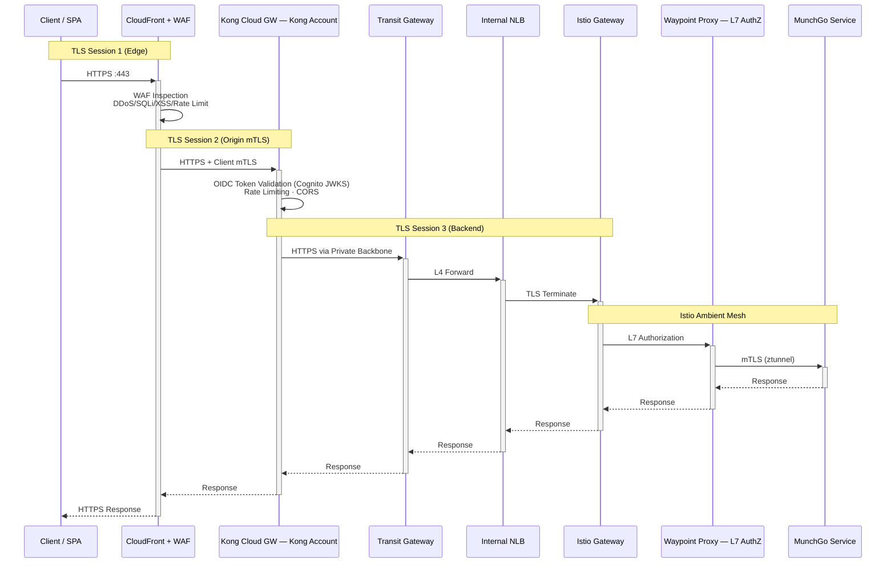
```mermaid
sequenceDiagram
    participant C as Client / SPA
    participant CF as CloudFront + WAF
    participant K as Kong Cloud GW — Kong Account
    participant TGW as Transit Gateway
    participant NLB as Internal NLB
    participant IG as Istio Gateway
    participant WP as Waypoint Proxy — L7 AuthZ
    participant App as MunchGo Service

    Note over C,CF: TLS Session 1 (Edge)
    C->>+CF: HTTPS :443
    CF->>CF: WAF Inspection<br/>DDoS/SQLi/XSS/Rate Limit

    Note over CF,K: TLS Session 2 (Origin mTLS)
    CF->>+K: HTTPS + Client mTLS
    K->>K: OIDC Token Validation (Cognito JWKS)<br/>Rate Limiting · CORS

    Note over K,IG: TLS Session 3 (Backend)
    K->>+TGW: HTTPS via Private Backbone
    TGW->>+NLB: L4 Forward
    NLB->>+IG: TLS Terminate

    Note over IG,App: Istio Ambient Mesh
    IG->>+WP: L7 Authorization
    WP->>+App: mTLS (ztunnel)
    App-->>-WP: Response
    WP-->>-IG: Response
    IG-->>-NLB: Response
    NLB-->>-TGW: Response
    TGW-->>-K: Response
    K-->>-CF: Response
    CF-->>-C: HTTPS Response
```

### Istio Ambient Service Mesh

MunchGo uses **Istio Ambient Mesh** — zero sidecar containers. L4 mTLS is handled by **ztunnel** (DaemonSet on every node). L7 policies are enforced by a **waypoint proxy** per namespace.

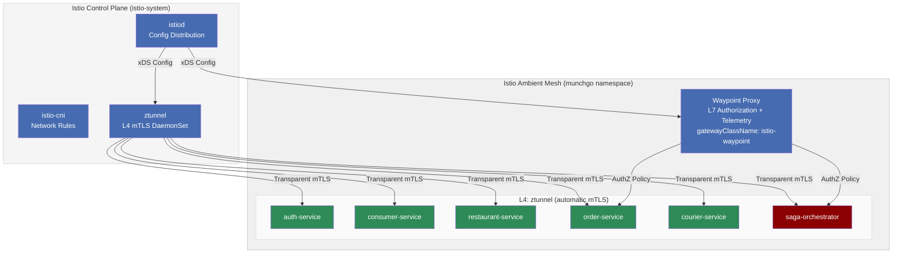
```mermaid
graph TB
    subgraph mesh ["Istio Ambient Mesh (munchgo namespace)"]
        subgraph l4 ["L4: ztunnel (automatic mTLS)"]
            AUTH2[auth-service]
            CONSUMER2[consumer-service]
            RESTAURANT2[restaurant-service]
            ORDER2[order-service]
            COURIER2[courier-service]
            SAGA2[saga-orchestrator]
        end

        WP2["Waypoint Proxy<br/>L7 Authorization + Telemetry<br/>gatewayClassName: istio-waypoint"]
    end

    subgraph control ["Istio Control Plane (istio-system)"]
        ISTIOD["istiod<br/>Config Distribution"]
        CNI["istio-cni<br/>Network Rules"]
        ZT["ztunnel<br/>L4 mTLS DaemonSet"]
    end

    ISTIOD -->|xDS Config| WP2
    ISTIOD -->|xDS Config| ZT
    ZT -->|Transparent mTLS| AUTH2
    ZT -->|Transparent mTLS| CONSUMER2
    ZT -->|Transparent mTLS| RESTAURANT2
    ZT -->|Transparent mTLS| ORDER2
    ZT -->|Transparent mTLS| COURIER2
    ZT -->|Transparent mTLS| SAGA2
    WP2 -->|AuthZ Policy| ORDER2
    WP2 -->|AuthZ Policy| SAGA2

    style WP2 fill:#466BB0,color:#fff
    style ISTIOD fill:#466BB0,color:#fff
    style ZT fill:#466BB0,color:#fff
    style CNI fill:#466BB0,color:#fff
    style AUTH2 fill:#2E8B57,color:#fff
    style CONSUMER2 fill:#2E8B57,color:#fff
    style RESTAURANT2 fill:#2E8B57,color:#fff
    style ORDER2 fill:#2E8B57,color:#fff
    style COURIER2 fill:#2E8B57,color:#fff
    style SAGA2 fill:#8B0000,color:#fff
    style mesh fill:#F0F0F0,stroke:#BBB,color:#333
    style control fill:#F5F5F5,stroke:#CCC,color:#333
    style l4 fill:#FAFAFA,stroke:#DDD,color:#333
```

| Component | Role | Scope |
|-----------|------|-------|
| **ztunnel** | L4 mTLS proxy (DaemonSet) | Automatic — encrypts all pod-to-pod traffic |
| **Waypoint** | L7 proxy (per namespace) | AuthorizationPolicy, telemetry, traffic management |
| **PeerAuthentication** | mTLS mode | `STRICT` — all traffic must be mTLS |
| **AuthorizationPolicy** | Access control | Restricts saga-orchestrator, allows gateway ingress |
| **Telemetry** | Observability | Jaeger tracing (100%), Prometheus metrics, access logs |

### East-West Traffic — How Services Communicate

MunchGo uses a **hybrid communication model**: synchronous HTTP calls for saga orchestration (protected by Istio mTLS) and asynchronous Kafka events for domain events (via external MSK).

**Only the Saga Orchestrator makes direct HTTP calls to other services.** All other services communicate exclusively via Kafka. Istio authorization policies enforce this — even though all services have ClusterIP endpoints, only authorized sources can reach them.

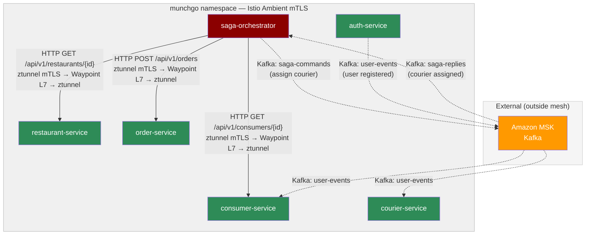
```mermaid
graph TB
    subgraph mesh_ew ["munchgo namespace — Istio Ambient mTLS"]
        SAGA_EW[saga-orchestrator]
        CONSUMER_EW[consumer-service]
        RESTAURANT_EW[restaurant-service]
        ORDER_EW[order-service]
        COURIER_EW[courier-service]
        AUTH_EW[auth-service]
    end

    subgraph external_ew ["External (outside mesh)"]
        KAFKA_EW["Amazon MSK<br/>Kafka"]
    end

    SAGA_EW -->|"HTTP GET /api/v1/consumers/{id}<br/>ztunnel mTLS → Waypoint L7 → ztunnel"| CONSUMER_EW
    SAGA_EW -->|"HTTP GET /api/v1/restaurants/{id}<br/>ztunnel mTLS → Waypoint L7 → ztunnel"| RESTAURANT_EW
    SAGA_EW -->|"HTTP POST /api/v1/orders<br/>ztunnel mTLS → Waypoint L7 → ztunnel"| ORDER_EW

    SAGA_EW -.->|"Kafka: saga-commands<br/>(assign courier)"| KAFKA_EW
    KAFKA_EW -.->|"Kafka: saga-replies<br/>(courier assigned)"| SAGA_EW
    AUTH_EW -.->|"Kafka: user-events<br/>(user registered)"| KAFKA_EW
    KAFKA_EW -.->|"Kafka: user-events"| CONSUMER_EW
    KAFKA_EW -.->|"Kafka: user-events"| COURIER_EW

    style SAGA_EW fill:#8B0000,color:#fff
    style AUTH_EW fill:#2E8B57,color:#fff
    style CONSUMER_EW fill:#2E8B57,color:#fff
    style RESTAURANT_EW fill:#2E8B57,color:#fff
    style ORDER_EW fill:#2E8B57,color:#fff
    style COURIER_EW fill:#2E8B57,color:#fff
    style KAFKA_EW fill:#FF9900,color:#fff
    style mesh_ew fill:#F0F0F0,stroke:#BBB,color:#333
    style external_ew fill:#F5F5F5,stroke:#CCC,color:#333
```

**Solid arrows** = synchronous HTTP (encrypted by Istio ztunnel mTLS, authorized by waypoint L7 policy).
**Dashed arrows** = asynchronous Kafka (external to mesh, via Amazon MSK).

#### Service Communication Matrix

| Source | Target | Protocol | Path / Topic | Istio mTLS? |
|--------|--------|----------|-------------|-------------|
| **Saga Orchestrator** | Consumer Service | HTTP GET | `/api/v1/consumers/{id}` | Yes (ztunnel + waypoint) |
| **Saga Orchestrator** | Restaurant Service | HTTP GET | `/api/v1/restaurants/{id}` | Yes (ztunnel + waypoint) |
| **Saga Orchestrator** | Order Service | HTTP POST/PUT | `/api/v1/orders`, `/api/v1/orders/{id}/approve` | Yes (ztunnel + waypoint) |
| **Saga Orchestrator** | Courier Service | Kafka | `saga-commands` topic | No (external MSK) |
| Courier Service | Saga Orchestrator | Kafka | `saga-replies` topic | No (external MSK) |
| Auth Service | Consumer Service | Kafka | `user-events` topic | No (external MSK) |
| Auth Service | Courier Service | Kafka | `user-events` topic | No (external MSK) |
| Istio Gateway | All services | HTTP | HTTPRoute path-based routing | Yes (ztunnel) |

#### How ztunnel and Waypoint Handle East-West Traffic

When the Saga Orchestrator calls the Consumer Service via HTTP:

```
Saga Pod → ztunnel (mTLS encrypt) → Waypoint (L7 AuthZ check) → ztunnel (mTLS decrypt) → Consumer Pod
```

1. **ztunnel** on the source node intercepts outbound traffic and encrypts it with mTLS (SPIFFE identity)
2. **Waypoint proxy** receives the encrypted traffic, terminates mTLS, and enforces L7 authorization policies (checking that the source service account is `munchgo-order-saga-orchestrator`)
3. **ztunnel** on the destination node re-encrypts and delivers to the Consumer pod
4. The **waypoint** also emits L7 telemetry: Jaeger traces, Prometheus request metrics, and access logs

Kafka traffic bypasses Istio entirely because MSK runs outside the cluster in dedicated AWS-managed infrastructure.

#### Istio Authorization Policies (Least Privilege)

Four policies enforce the communication matrix:

| Policy | What It Does |
|--------|-------------|
| `allow-gateway-ingress` | Istio Gateway (istio-ingress namespace) can reach all 5 backend services |
| `allow-saga-orchestrator` | Saga Orchestrator service account can call Consumer, Restaurant, Order, Courier |
| `restrict-saga-orchestrator` | Saga Orchestrator reachable from within munchgo namespace + Istio Gateway (north-south ingress for `/api/v1/sagas`) |
| `allow-health-checks` | Any source can reach `/actuator/health/*` endpoints (for K8s probes) |

**Default deny**: any traffic not explicitly allowed is blocked. If Consumer Service tried to call Order Service via HTTP, the waypoint would reject it — only Saga Orchestrator has that permission.

### Private Connectivity

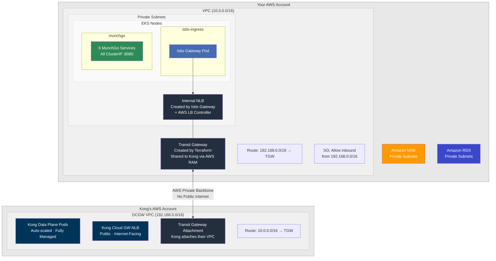
```mermaid
graph TB
    subgraph your_acct2 ["Your AWS Account"]
        subgraph VPC ["VPC (10.0.0.0/16)"]
            subgraph PrivSubnets [Private Subnets]
                subgraph EKSNodes [EKS Nodes]
                    subgraph ns_istio_ingress ["istio-ingress"]
                        gw_pod[Istio Gateway Pod]
                    end
                    subgraph ns_munchgo2 ["munchgo"]
                        services_n["6 MunchGo Services<br/>All ClusterIP :8080"]
                    end
                end
                INLB["Internal NLB<br/>Created by Istio Gateway<br/>+ AWS LB Controller"]
            end
            TGW_Y["Transit Gateway<br/>Created by Terraform<br/>Shared to Kong via AWS RAM"]
            RT_Y[Route: 192.168.0.0/16 → TGW]
            SG_Y["SG: Allow inbound<br/>from 192.168.0.0/16"]
        end
        MSK2["Amazon MSK<br/>Private Subnets"]
        RDS2["Amazon RDS<br/>Private Subnets"]
    end

    subgraph kong_acct2 ["Kong's AWS Account"]
        subgraph KVPC ["DCGW VPC (192.168.0.0/16)"]
            KDP["Kong Data Plane Pods<br/>Auto-scaled · Fully Managed"]
            KNLB["Kong Cloud GW NLB<br/>Public · Internet-Facing"]
            TGW_K["Transit Gateway Attachment<br/>Kong attaches their VPC"]
            RT_K[Route: 10.0.0.0/16 → TGW]
        end
    end

    gw_pod --> INLB
    INLB --- TGW_Y
    TGW_Y <-->|"AWS Private Backbone<br/>No Public Internet"| TGW_K

    style TGW_Y fill:#232F3E,color:#fff
    style TGW_K fill:#232F3E,color:#fff
    style INLB fill:#232F3E,color:#fff
    style KNLB fill:#003459,color:#fff
    style KDP fill:#003459,color:#fff
    style gw_pod fill:#466BB0,color:#fff
    style services_n fill:#2E8B57,color:#fff
    style MSK2 fill:#FF9900,color:#fff
    style RDS2 fill:#3B48CC,color:#fff
    style your_acct2 fill:#E8E8E8,stroke:#999,color:#333
    style kong_acct2 fill:#E8E8E8,stroke:#999,color:#333
    style VPC fill:#F0F0F0,stroke:#BBB,color:#333
    style KVPC fill:#F0F0F0,stroke:#BBB,color:#333
    style PrivSubnets fill:#F5F5F5,stroke:#CCC,color:#333
    style EKSNodes fill:#FAFAFA,stroke:#DDD,color:#333
```

How it works (all automated):

1. **Terraform** creates the Transit Gateway, VPC attachment, route tables, and security group rules
2. **Setup script** fetches Kong's AWS account ID from Konnect, adds it as a RAM principal, and creates the TGW attachment
3. **Transit Gateway** auto-accepts Kong's attachment (`auto_accept_shared_attachments` is enabled)
4. Route tables on both sides direct cross-VPC traffic through the Transit Gateway
5. No manual steps — no AWS Console acceptance needed

### Security Layers

| Layer | Component | Protection |
|-------|-----------|------------|
| 1 | CloudFront + WAF | DDoS, SQLi/XSS, rate limiting, geo-blocking |
| 2 | Origin mTLS | CloudFront bypass prevention (via CloudFormation) |
| 3 | Kong Plugins | OpenID Connect (Cognito JWKS), per-route rate limiting, CORS, request transform |
| 4 | Transit Gateway | Private connectivity — backends never exposed publicly |
| 5 | Istio Ambient mTLS | Automatic L4 encryption between all mesh pods (ztunnel) |
| 6 | Waypoint AuthZ | L7 authorization policies for east-west traffic |
| 7 | PeerAuthentication | Strict mTLS enforcement — no plaintext allowed |
| 8 | ClusterIP Services | No direct external access to backend services |
| 9 | External Secrets | AWS Secrets Manager → K8s Secrets via IRSA (no hardcoded credentials) |

---

## MunchGo Microservices

A food delivery platform built with Java 21 + Spring Boot, following event-driven, CQRS, and saga orchestration patterns.

### Service Architecture

The platform uses two distinct communication patterns: **north-south** traffic enters via Kong Cloud Gateway through the Istio Gateway, while **east-west** traffic between services uses a mix of synchronous HTTP (via Istio mTLS) and asynchronous Kafka events (via external MSK).

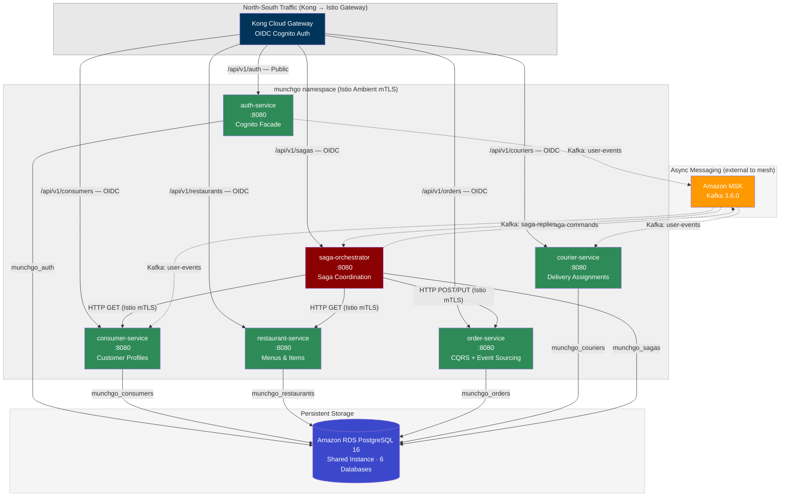
```mermaid
graph TB
    subgraph external ["North-South Traffic (Kong → Istio Gateway)"]
        KONG["Kong Cloud Gateway<br/>OIDC Cognito Auth"]
    end

    subgraph munchgo_ns ["munchgo namespace (Istio Ambient mTLS)"]
        AUTH3["auth-service<br/>:8080<br/>Cognito Facade"]
        CONSUMER3["consumer-service<br/>:8080<br/>Customer Profiles"]
        RESTAURANT3["restaurant-service<br/>:8080<br/>Menus & Items"]
        ORDER3["order-service<br/>:8080<br/>CQRS + Event Sourcing"]
        COURIER3["courier-service<br/>:8080<br/>Delivery Assignments"]
        SAGA3["saga-orchestrator<br/>:8080<br/>Saga Coordination"]
    end

    subgraph messaging ["Async Messaging (external to mesh)"]
        KAFKA["Amazon MSK<br/>Kafka 3.6.0"]
    end

    subgraph storage ["Persistent Storage"]
        DB[("Amazon RDS PostgreSQL 16<br/>Shared Instance · 6 Databases")]
    end

    KONG -->|/api/v1/auth — Public| AUTH3
    KONG -->|/api/v1/consumers — OIDC| CONSUMER3
    KONG -->|/api/v1/restaurants — OIDC| RESTAURANT3
    KONG -->|/api/v1/orders — OIDC| ORDER3
    KONG -->|/api/v1/couriers — OIDC| COURIER3
    KONG -->|/api/v1/sagas — OIDC| SAGA3

    SAGA3 -->|"HTTP GET (Istio mTLS)"| CONSUMER3
    SAGA3 -->|"HTTP GET (Istio mTLS)"| RESTAURANT3
    SAGA3 -->|"HTTP POST/PUT (Istio mTLS)"| ORDER3

    AUTH3 -.->|"Kafka: user-events"| KAFKA
    SAGA3 -.->|"Kafka: saga-commands"| KAFKA
    KAFKA -.->|"Kafka: user-events"| CONSUMER3
    KAFKA -.->|"Kafka: user-events"| COURIER3
    KAFKA -.->|"Kafka: saga-replies"| SAGA3

    AUTH3 -->|munchgo_auth| DB
    CONSUMER3 -->|munchgo_consumers| DB
    RESTAURANT3 -->|munchgo_restaurants| DB
    ORDER3 -->|munchgo_orders| DB
    COURIER3 -->|munchgo_couriers| DB
    SAGA3 -->|munchgo_sagas| DB

    style KONG fill:#003459,color:#fff
    style AUTH3 fill:#2E8B57,color:#fff
    style CONSUMER3 fill:#2E8B57,color:#fff
    style RESTAURANT3 fill:#2E8B57,color:#fff
    style ORDER3 fill:#2E8B57,color:#fff
    style COURIER3 fill:#2E8B57,color:#fff
    style SAGA3 fill:#8B0000,color:#fff
    style KAFKA fill:#FF9900,color:#fff
    style DB fill:#3B48CC,color:#fff
    style external fill:#E8E8E8,stroke:#999,color:#333
    style munchgo_ns fill:#F0F0F0,stroke:#BBB,color:#333
    style messaging fill:#F5F5F5,stroke:#CCC,color:#333
    style storage fill:#F5F5F5,stroke:#CCC,color:#333
```

> **Solid arrows** between services = synchronous HTTP calls, encrypted by Istio ztunnel mTLS and authorized by waypoint L7 policy.
> **Dashed arrows** to/from Kafka = asynchronous events, external to the mesh (Amazon MSK).

### Service Details

| Service | Port | Database | Kong Route | Auth | Pattern |
|---------|------|----------|------------|------|---------|
| **auth-service** | 8080 | munchgo_auth | `/api/v1/auth` | Public | Cognito facade |
| **consumer-service** | 8080 | munchgo_consumers | `/api/v1/consumers` | OIDC | CRUD |
| **restaurant-service** | 8080 | munchgo_restaurants | `/api/v1/restaurants` | OIDC | CRUD |
| **order-service** | 8080 | munchgo_orders | `/api/v1/orders` | OIDC | CQRS + Event Sourcing |
| **courier-service** | 8080 | munchgo_couriers | `/api/v1/couriers` | OIDC | CRUD |
| **saga-orchestrator** | 8080 | munchgo_sagas | `/api/v1/sagas` | OIDC | Saga Orchestration |

### Authentication — Amazon Cognito + OIDC

**Amazon Cognito** is the identity provider. **Only the auth-service talks to Cognito** — all other services rely on Kong's upstream headers for user identity. Kong validates tokens at the edge using the **OpenID Connect** plugin with automatic JWKS discovery.

#### Cognito Interaction Model

| Component | Auth Responsibility |
|-----------|-------------------|
| **Amazon Cognito** | Identity store, password hashing, token issuance, JWKS endpoint, group membership |
| **auth-service** | Cognito facade — proxies register/login/refresh/logout, maintains local user ref, publishes Kafka events |
| **Kong OIDC plugin** | Token validation at the edge via JWKS, claims extraction → upstream headers |
| **Pre Token Lambda** | Injects `custom:roles` claim into access + ID tokens based on User Pool groups |
| **Other services** | Read `X-User-*` headers — zero auth logic, fully trust Kong's verification |
| **Istio mTLS** | Encrypts and authenticates all pod-to-pod traffic (east-west) — separate from Cognito |

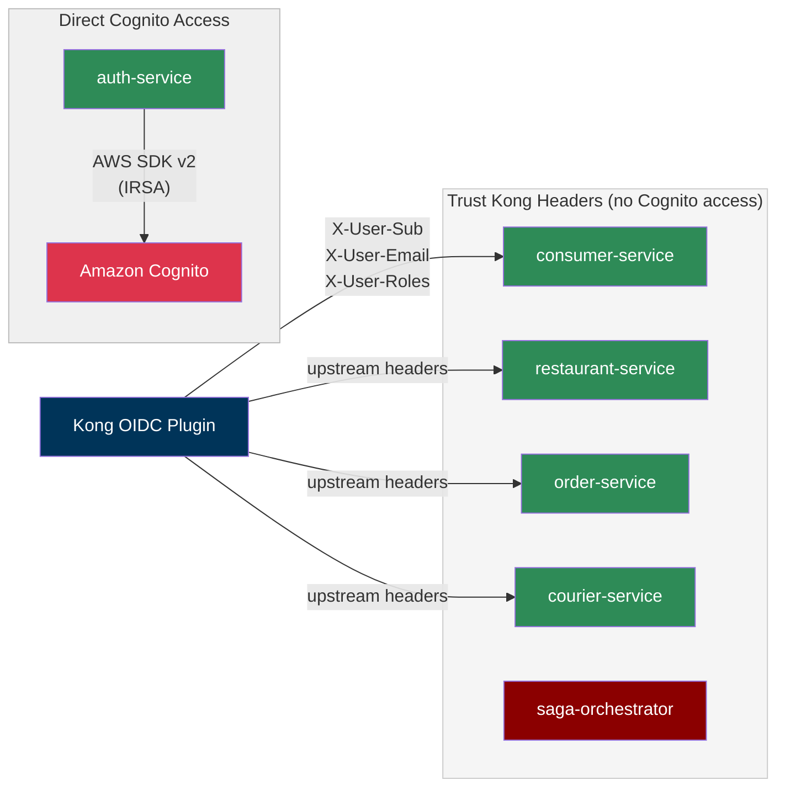
```mermaid
graph LR
    subgraph direct ["Direct Cognito Access"]
        AUTH_C[auth-service] -->|"AWS SDK v2<br/>(IRSA)"| COG[Amazon Cognito]
    end

    subgraph trust ["Trust Kong Headers (no Cognito access)"]
        CS[consumer-service]
        RS[restaurant-service]
        OS[order-service]
        CRS[courier-service]
        SAGA_C[saga-orchestrator]
    end

    KONG_C[Kong OIDC Plugin] -->|"X-User-Sub<br/>X-User-Email<br/>X-User-Roles"| CS
    KONG_C -->|upstream headers| RS
    KONG_C -->|upstream headers| OS
    KONG_C -->|upstream headers| CRS

    style AUTH_C fill:#2E8B57,color:#fff
    style COG fill:#DD344C,color:#fff
    style KONG_C fill:#003459,color:#fff
    style CS fill:#2E8B57,color:#fff
    style RS fill:#2E8B57,color:#fff
    style OS fill:#2E8B57,color:#fff
    style CRS fill:#2E8B57,color:#fff
    style SAGA_C fill:#8B0000,color:#fff
    style direct fill:#F0F0F0,stroke:#BBB,color:#333
    style trust fill:#F5F5F5,stroke:#CCC,color:#333
```

#### Registration Flow

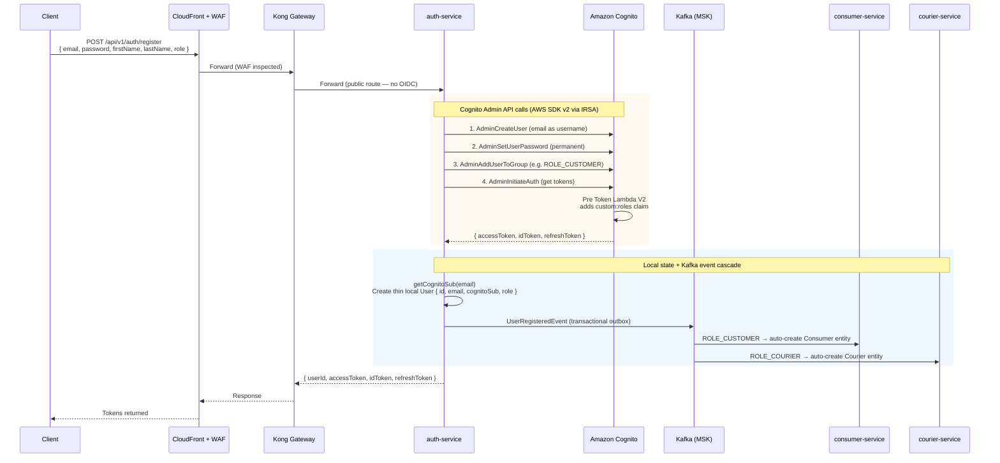
```mermaid
sequenceDiagram
    participant C as Client
    participant CF as CloudFront + WAF
    participant Kong as Kong Gateway
    participant Auth as auth-service
    participant Cognito as Amazon Cognito
    participant Kafka as Kafka (MSK)
    participant CS as consumer-service
    participant CR as courier-service

    C->>CF: POST /api/v1/auth/register<br/>{ email, password, firstName, lastName, role }
    CF->>Kong: Forward (WAF inspected)
    Kong->>Auth: Forward (public route — no OIDC)

    rect rgb(255, 248, 240)
        Note over Auth,Cognito: Cognito Admin API calls (AWS SDK v2 via IRSA)
        Auth->>Cognito: 1. AdminCreateUser (email as username)
        Auth->>Cognito: 2. AdminSetUserPassword (permanent)
        Auth->>Cognito: 3. AdminAddUserToGroup (e.g. ROLE_CUSTOMER)
        Auth->>Cognito: 4. AdminInitiateAuth (get tokens)
        Cognito->>Cognito: Pre Token Lambda V2<br/>adds custom:roles claim
        Cognito-->>Auth: { accessToken, idToken, refreshToken }
    end

    rect rgb(240, 248, 255)
        Note over Auth,CR: Local state + Kafka event cascade
        Auth->>Auth: getCognitoSub(email)<br/>Create thin local User { id, email, cognitoSub, role }
        Auth->>Kafka: UserRegisteredEvent (transactional outbox)
        Kafka->>CS: ROLE_CUSTOMER → auto-create Consumer entity
        Kafka->>CR: ROLE_COURIER → auto-create Courier entity
    end

    Auth-->>Kong: { userId, accessToken, idToken, refreshToken }
    Kong-->>CF: Response
    CF-->>C: Tokens returned
```

#### Login Flow

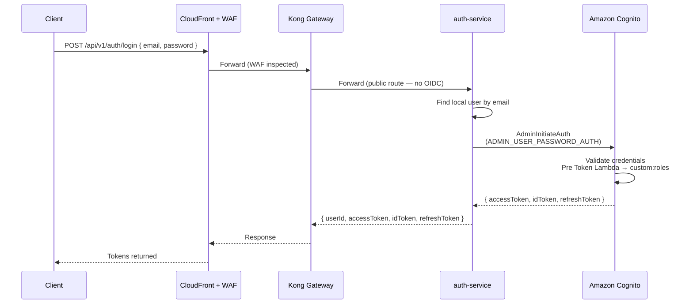
```mermaid
sequenceDiagram
    participant C as Client
    participant CF as CloudFront + WAF
    participant Kong as Kong Gateway
    participant Auth as auth-service
    participant Cognito as Amazon Cognito

    C->>CF: POST /api/v1/auth/login { email, password }
    CF->>Kong: Forward (WAF inspected)
    Kong->>Auth: Forward (public route — no OIDC)
    Auth->>Auth: Find local user by email
    Auth->>Cognito: AdminInitiateAuth<br/>(ADMIN_USER_PASSWORD_AUTH)
    Cognito->>Cognito: Validate credentials<br/>Pre Token Lambda → custom:roles
    Cognito-->>Auth: { accessToken, idToken, refreshToken }
    Auth-->>Kong: { userId, accessToken, idToken, refreshToken }
    Kong-->>CF: Response
    CF-->>C: Tokens returned
```

#### Authorization Flow (Protected API Call)

This is where Kong's OIDC plugin does the heavy lifting — **no microservice auth code involved**:

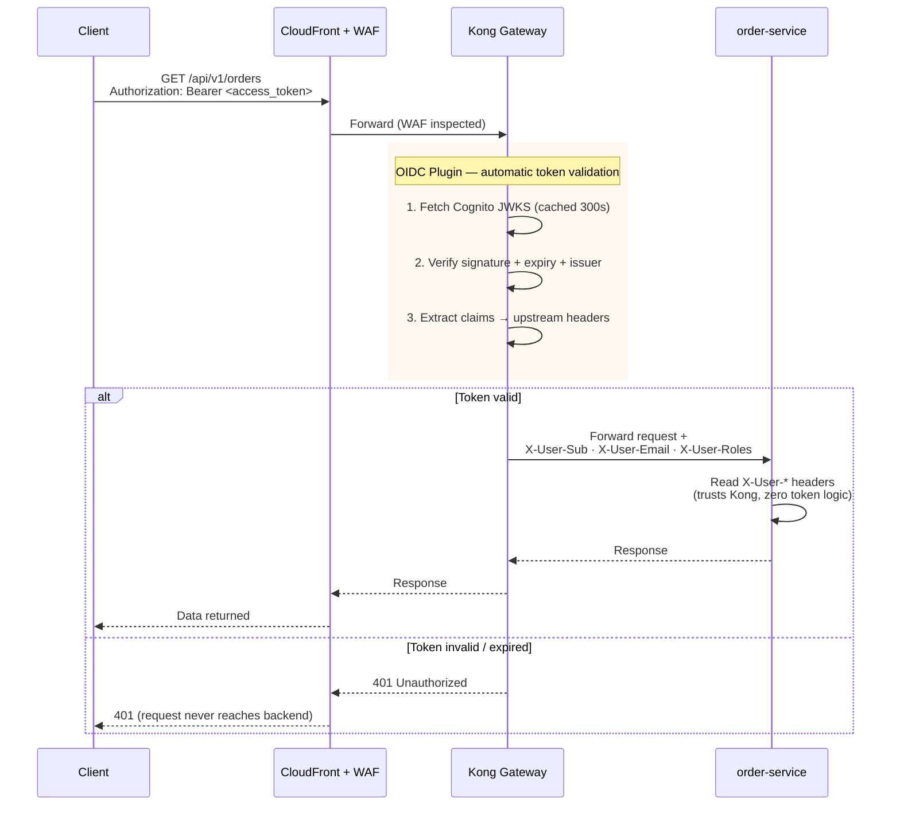
```mermaid
sequenceDiagram
    participant C as Client
    participant CF as CloudFront + WAF
    participant Kong as Kong Gateway
    participant Svc as order-service

    C->>CF: GET /api/v1/orders<br/>Authorization: Bearer <access_token>
    CF->>Kong: Forward (WAF inspected)

    rect rgb(255, 248, 240)
        Note over Kong: OIDC Plugin — automatic token validation
        Kong->>Kong: 1. Fetch Cognito JWKS (cached 300s)
        Kong->>Kong: 2. Verify signature + expiry + issuer
        Kong->>Kong: 3. Extract claims → upstream headers
    end

    alt Token valid
        Kong->>Svc: Forward request +<br/>X-User-Sub · X-User-Email · X-User-Roles
        Svc->>Svc: Read X-User-* headers<br/>(trusts Kong, zero token logic)
        Svc-->>Kong: Response
        Kong-->>CF: Response
        CF-->>C: Data returned
    else Token invalid / expired
        Kong-->>CF: 401 Unauthorized
        CF-->>C: 401 (request never reaches backend)
    end
```

#### Token Refresh & Logout

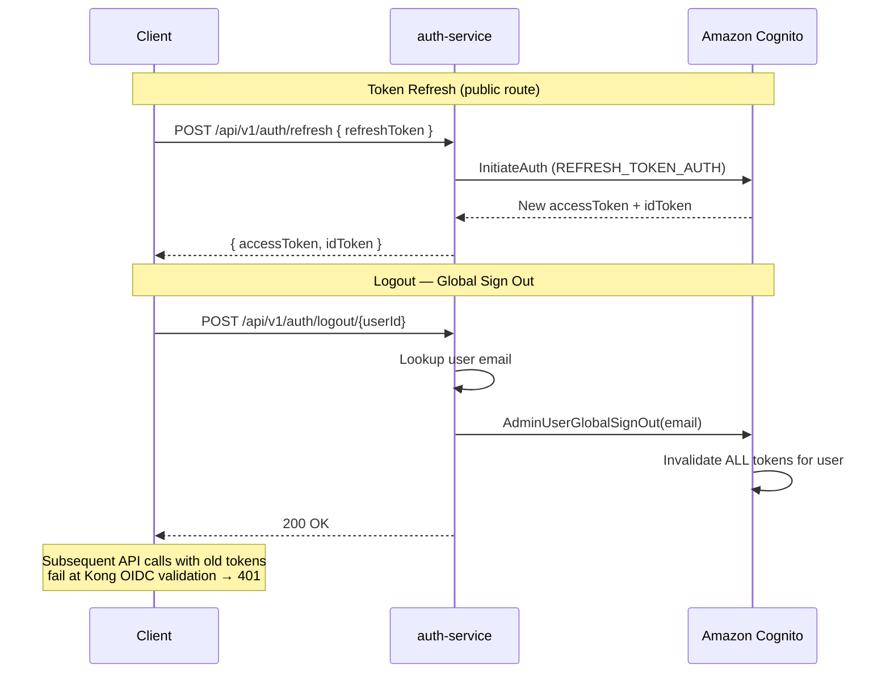
```mermaid
sequenceDiagram
    participant C as Client
    participant Auth as auth-service
    participant Cognito as Amazon Cognito

    Note over C,Cognito: Token Refresh (public route)
    C->>Auth: POST /api/v1/auth/refresh { refreshToken }
    Auth->>Cognito: InitiateAuth (REFRESH_TOKEN_AUTH)
    Cognito-->>Auth: New accessToken + idToken
    Auth-->>C: { accessToken, idToken }

    Note over C,Cognito: Logout — Global Sign Out
    C->>Auth: POST /api/v1/auth/logout/{userId}
    Auth->>Auth: Lookup user email
    Auth->>Cognito: AdminUserGlobalSignOut(email)
    Cognito->>Cognito: Invalidate ALL tokens for user
    Auth-->>C: 200 OK
    Note over C: Subsequent API calls with old tokens<br/>fail at Kong OIDC validation → 401
```

#### Cognito Configuration

**User Pool:**
- Password policy: min 8 chars, uppercase/lowercase/numbers/symbols
- User Pool Groups: `ROLE_CUSTOMER`, `ROLE_RESTAURANT_OWNER`, `ROLE_COURIER`, `ROLE_ADMIN`
- Pre Token Generation Lambda (V2): adds `custom:roles` claim to access + ID tokens
- Token validity: Access=1hr, ID=1hr, Refresh=7 days
- Provisioned by Terraform (`terraform/modules/cognito/`)
- Secrets stored in AWS Secrets Manager, synced to K8s via External Secrets Operator

**Kong OIDC plugin (per protected route):**
- Auto-discovers Cognito JWKS via `.well-known/openid-configuration`
- Validates token signature, expiry, and issuer
- Forwards claims as upstream headers: `X-User-Sub`, `X-User-Email`, `X-User-Roles`
- Protected routes: `/api/v1/consumers`, `/api/v1/orders`, `/api/v1/couriers`, `/api/v1/restaurants`, `/api/v1/sagas`
- Public routes: `/api/v1/auth/*` (register, login, refresh, logout), `/healthz`
- JWKS cache TTL: 300s — automatic key rotation with zero downtime

**auth-service IRSA:**
- Runs with a K8s ServiceAccount annotated with an IAM role (`eks.amazonaws.com/role-arn`)
- IAM policy grants Cognito Admin API access: `AdminCreateUser`, `AdminInitiateAuth`, `AdminSetUserPassword`, `AdminAddUserToGroup`, `AdminGetUser`, `AdminUserGlobalSignOut`, etc.
- AWS SDK `DefaultCredentialsProvider` picks up IRSA tokens automatically — no hardcoded credentials

### Order Saga Flow

The saga orchestrator uses a **hybrid approach**: synchronous HTTP calls (via Istio mTLS) for validation and order management, and asynchronous Kafka commands for courier assignment. Circuit breakers (Resilience4j) protect all HTTP calls.

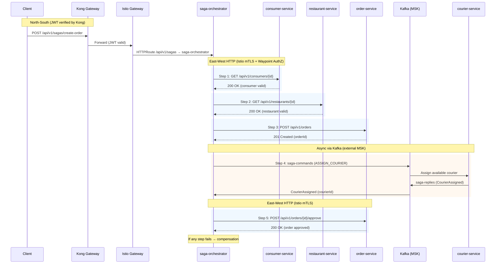
```mermaid
sequenceDiagram
    participant C as Client
    participant Kong as Kong Gateway
    participant IG as Istio Gateway
    participant S as saga-orchestrator
    participant CS as consumer-service
    participant RS as restaurant-service
    participant O as order-service
    participant K as Kafka (MSK)
    participant CR as courier-service

    Note over C,Kong: North-South (JWT verified by Kong)
    C->>Kong: POST /api/v1/sagas/create-order
    Kong->>IG: Forward (JWT valid)
    IG->>S: HTTPRoute /api/v1/sagas → saga-orchestrator

    Note over S,CS: East-West HTTP (Istio mTLS + Waypoint AuthZ)
    rect rgb(240, 248, 255)
        S->>CS: Step 1: GET /api/v1/consumers/{id}
        CS-->>S: 200 OK (consumer valid)
    end

    rect rgb(240, 248, 255)
        S->>RS: Step 2: GET /api/v1/restaurants/{id}
        RS-->>S: 200 OK (restaurant valid)
    end

    rect rgb(240, 248, 255)
        S->>O: Step 3: POST /api/v1/orders
        O-->>S: 201 Created (orderId)
    end

    Note over S,CR: Async via Kafka (external MSK)
    rect rgb(255, 248, 240)
        S->>K: Step 4: saga-commands (ASSIGN_COURIER)
        K->>CR: Assign available courier
        CR->>K: saga-replies (CourierAssigned)
        K->>S: CourierAssigned (courierId)
    end

    Note over S,O: East-West HTTP (Istio mTLS)
    rect rgb(240, 248, 255)
        S->>O: Step 5: POST /api/v1/orders/{id}/approve
        O-->>S: 200 OK (order approved)
    end

    Note over S,S: If any step fails → compensation
```

**Why hybrid?** Steps 1-3 and 5 need immediate responses (is the consumer valid? does the restaurant exist?) — synchronous HTTP is appropriate. Step 4 uses Kafka because courier assignment may take time (finding an available courier), making async messaging the better fit.

#### Kafka Topics

| Topic | Publisher | Consumer | Purpose |
|-------|-----------|----------|---------|
| `user-events` | Auth Service | Consumer Service, Courier Service | Auto-create profile on user registration |
| `saga-commands` | Saga Orchestrator | Courier Service | Assign courier to order |
| `saga-replies` | Courier Service | Saga Orchestrator | Courier assignment result |

---

### MunchGo React SPA

The frontend is a **React 19 + TypeScript** single-page application served from **S3 via CloudFront**. Static assets never touch Kong — only `/api/*` and `/healthz` requests are proxied to Kong Cloud Gateway.

| Technology | Version | Purpose |
|-----------|---------|---------|
| React | 19 | UI framework |
| TypeScript | 5.9 | Type safety |
| Vite | 7.3 | Build tool (fast HMR, ESM-native) |
| Tailwind CSS | 4.1 | Utility-first styling |
| React Router | 7.13 | Client-side routing |
| Axios | 1.13 | HTTP client with auth interceptors |

**CloudFront routing:**
- `/` → S3 (React SPA `index.html`)
- `/assets/*` → S3 (hashed JS/CSS with 1-year immutable cache)
- `/api/*` → Kong Cloud Gateway (API requests, no cache)
- `/healthz` → Kong Cloud Gateway (platform health check)

**Features:**
- Cognito authentication (login, register, token refresh, logout)
- Role-based routing: Customer, Restaurant Owner, Courier, Admin dashboards
- Typed API client with automatic Bearer token injection and 401 refresh
- Custom error responses (403/404 → `index.html`) for SPA client-side routing

**Guest browsing:** Unauthenticated users can browse restaurants and view menus. The order form (delivery address + place order) is only shown to logged-in users — guests see a "Sign in to place your order" prompt with links to login/register.

**Repository:** [`munchgo-spa`](https://github.com/shanaka-versent/munchgo-spa) — deployed via GitHub Actions CI/CD (OIDC → S3 sync → CloudFront invalidation)

### Default Admin User

A default admin user is seeded during deployment (matching the monolith's `admin` / `admin123` pattern, adapted for Cognito password requirements):

| Field | Value |
|-------|-------|
| **Email** | `admin@munchgo.com` |
| **Password** | `Admin@123` |
| **Role** | `ROLE_ADMIN` |

The admin user is created by `scripts/04-seed-admin-user.sh`, which runs automatically as part of post-terraform setup. It creates the user in both **Cognito** (identity provider) and the **auth-service database** (local user reference).

To create the admin manually (or re-run if needed):

```bash
./scripts/04-seed-admin-user.sh
```

### Business Logic — Role-Based Access

| Role | Capabilities |
|------|-------------|
| **Guest** (unauthenticated) | Browse restaurants, view menus |
| **ROLE_CUSTOMER** | All guest capabilities + place orders, view order history, cancel approved orders |
| **ROLE_RESTAURANT_OWNER** | Approve/reject orders, manage preparation status |
| **ROLE_COURIER** | View ready pickups, mark pickup/delivery |
| **ROLE_ADMIN** | View all orders, consumers, restaurants, couriers, users |

**Order lifecycle:**

```
APPROVAL_PENDING → APPROVED → ACCEPTED → PREPARING → READY_FOR_PICKUP → PICKED_UP → DELIVERED
                ↓
            REJECTED
APPROVED → CANCELLED (customer only)
```

---

## Repository Structure

### Four-Repo GitOps Model

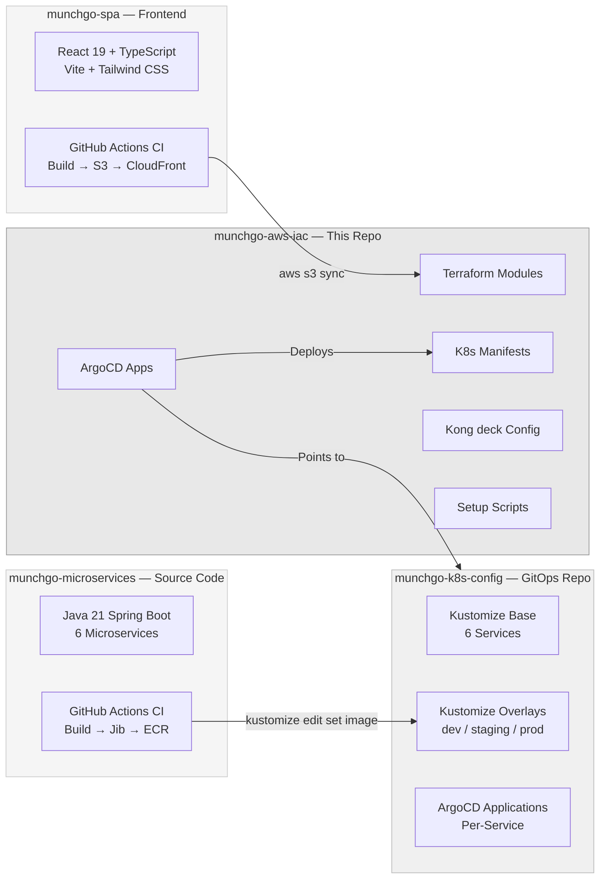
```mermaid
graph LR
    subgraph infra ["munchgo-aws-iac — This Repo"]
        TF[Terraform Modules]
        K8S[K8s Manifests]
        ARGO[ArgoCD Apps]
        DECK[Kong deck Config]
        SCRIPTS[Setup Scripts]
    end

    subgraph gitops ["munchgo-k8s-config — GitOps Repo"]
        BASE["Kustomize Base<br/>6 Services"]
        OVL["Kustomize Overlays<br/>dev / staging / prod"]
        APPS["ArgoCD Applications<br/>Per-Service"]
    end

    subgraph micro ["munchgo-microservices — Source Code"]
        SRC["Java 21 Spring Boot<br/>6 Microservices"]
        CI["GitHub Actions CI<br/>Build → Jib → ECR"]
    end

    subgraph spa_repo ["munchgo-spa — Frontend"]
        SPA_SRC["React 19 + TypeScript<br/>Vite + Tailwind CSS"]
        SPA_CI["GitHub Actions CI<br/>Build → S3 → CloudFront"]
    end

    CI -->|"kustomize edit set image"| OVL
    ARGO -->|"Points to"| gitops
    ARGO -->|"Deploys"| K8S
    SPA_CI -->|"aws s3 sync"| TF

    style infra fill:#E8E8E8,stroke:#999,color:#333
    style gitops fill:#F0F0F0,stroke:#BBB,color:#333
    style micro fill:#F5F5F5,stroke:#CCC,color:#333
    style spa_repo fill:#F5F5F5,stroke:#CCC,color:#333
```

| Repository | Purpose | Branch |
|------------|---------|--------|
| [`munchgo-aws-iac`](https://github.com/shanaka-versent/munchgo-aws-iac) | Infrastructure, K8s manifests, ArgoCD, Kong config | `main` |
| [`munchgo-k8s-config`](https://github.com/shanaka-versent/munchgo-k8s-config) | GitOps — Kustomize manifests for MunchGo deployments | `main` |
| [`munchgo-microservices`](https://github.com/shanaka-versent/munchgo-microservices) | Source code — Java 21 Spring Boot microservices + CI | `main` |
| [`munchgo-spa`](https://github.com/shanaka-versent/munchgo-spa) | React SPA frontend — Cognito auth, role-based UI + CI/CD | `main` |

### This Repo — Directory Layout

```
.
├── argocd/apps/                    # ArgoCD App of Apps (sync wave ordered)
│   ├── root-app.yaml               #   Root application (bootstrapped by Terraform)
│   ├── 00-gateway-api-crds.yaml    #   Wave -2: Gateway API CRDs
│   ├── 01-namespaces.yaml          #   Wave  1: Namespaces (ambient labeled)
│   ├── 02-istio-base.yaml          #   Wave -1: Istio CRDs
│   ├── 03-istiod.yaml              #   Wave  0: Istio control plane
│   ├── 04-istio-cni.yaml           #   Wave  0: Istio CNI plugin
│   ├── 05-ztunnel.yaml             #   Wave  0: ztunnel L4 mTLS
│   ├── 06-gateway.yaml             #   Wave  5: Istio Gateway (internal NLB)
│   ├── 07-httproutes.yaml          #   Wave  6: HTTPRoutes for MunchGo APIs
│   ├── 08-apps.yaml                #   Wave  7: Platform apps (health-responder)
│   ├── 09-external-secrets.yaml    #   Wave  8: External Secrets Operator (Helm)
│   ├── 09-munchgo-apps.yaml        #   Wave  8: Layer 3→4 bridge (munchgo-k8s-config repo)
│   ├── 09-external-secrets-config.yaml # Wave 9: ClusterSecretStore + ExternalSecrets
│   ├── 10-istio-mesh-policies.yaml #   Wave 10: Waypoint, AuthZ, PeerAuth, Telemetry
│   ├── 11-prometheus.yaml          #   Wave 11: Prometheus + Grafana
│   ├── 12-jaeger.yaml              #   Wave 12: Jaeger distributed tracing
│   └── 12-kiali.yaml               #   Wave 12: Kiali service mesh dashboard
├── deck/
│   └── kong.yaml                   # Kong Gateway configuration (decK format)
├── insomnia/
│   └── munchgo-api.json            # Insomnia API collection (all MunchGo endpoints)
├── k8s/
│   ├── namespace.yaml              # Namespace definitions (ambient mesh labeled)
│   ├── apps/
│   │   └── health-responder.yaml   # Gateway health check endpoint
│   ├── external-secrets/
│   │   ├── cluster-secret-store.yaml   # AWS Secrets Manager ClusterSecretStore
│   │   ├── munchgo-db-secret.yaml      # ExternalSecrets for 6 service databases
│   │   └── munchgo-cognito-secret.yaml # ExternalSecret for Cognito config (User Pool ID, Client ID)
│   └── istio/
│       ├── gateway.yaml            # Istio Gateway (internal NLB + TLS)
│       ├── httproutes.yaml         # MunchGo API routes + ReferenceGrants
│       ├── waypoint.yaml           # Waypoint proxy (L7 in ambient mesh)
│       ├── authorization-policies.yaml # East-west access control
│       ├── peer-authentication.yaml    # Strict mTLS enforcement
│       ├── telemetry.yaml          # Jaeger tracing + Prometheus metrics
│       └── tls-secret.yaml         # TLS secret reference
├── scripts/
│   ├── 01-generate-certs.sh        # Generate TLS certs + K8s secret
│   ├── 02-setup-cloud-gateway.sh   # Fully automated Kong Konnect setup
│   ├── 02-generate-jwt.sh          # Generate JWT tokens for testing
│   ├── 03-post-terraform-setup.sh  # Post-apply NLB endpoint discovery + admin seed
│   ├── 04-seed-admin-user.sh       # Seed default admin user (Cognito + auth DB)
│   └── destroy.sh                  # Full stack teardown (correct order)
└── terraform/
    ├── main.tf                     # Root module — orchestrates all modules
    ├── variables.tf                # All configurable parameters
    ├── outputs.tf                  # Stack outputs (endpoints, ARNs, etc.)
    ├── providers.tf                # AWS provider configuration
    └── modules/
        ├── vpc/                    # VPC, subnets, NAT, IGW
        ├── eks/                    # EKS cluster + system/user node pools
        ├── iam/                    # LB Controller IRSA + External Secrets IRSA + Cognito Auth IRSA + GitHub OIDC + SPA Deploy
        ├── lb-controller/          # AWS Load Balancer Controller (Helm)
        ├── argocd/                 # ArgoCD + root app bootstrap
        ├── cloudfront/             # CloudFront + WAF + Origin mTLS
        ├── ecr/                    # 6 ECR repositories (MunchGo services)
        ├── msk/                    # Amazon MSK Kafka cluster
        ├── rds/                    # RDS PostgreSQL + Secrets Manager
        ├── cognito/                # Amazon Cognito User Pool, App Client, Groups, Lambda
        └── spa/                    # S3 bucket for React SPA
```

---

## GitOps Pipeline

### CI/CD Flow

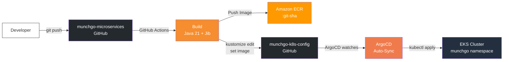
```mermaid
graph LR
    DEV[Developer] -->|git push| MICRO["munchgo-microservices<br/>GitHub"]
    MICRO -->|GitHub Actions| BUILD["Build<br/>Java 21 + Jib"]
    BUILD -->|Push Image| ECR["Amazon ECR<br/>:git-sha"]
    BUILD -->|"kustomize edit<br/>set image"| GITOPS["munchgo-k8s-config<br/>GitHub"]
    GITOPS -->|ArgoCD watches| ARGO["ArgoCD<br/>Auto-Sync"]
    ARGO -->|kubectl apply| EKS["EKS Cluster<br/>munchgo namespace"]

    style DEV fill:#fff,stroke:#333,color:#333
    style MICRO fill:#24292E,color:#fff
    style BUILD fill:#F68D2E,color:#fff
    style ECR fill:#FF9900,color:#fff
    style GITOPS fill:#24292E,color:#fff
    style ARGO fill:#EF7B4D,color:#fff
    style EKS fill:#232F3E,color:#fff
```

1. Developer pushes code to `munchgo-microservices`
2. **GitHub Actions** builds the container image using Jib (no Docker daemon needed)
3. Image is pushed to **Amazon ECR** with the git SHA as the tag
4. CI updates the **kustomize overlay** in `munchgo-k8s-config` via `kustomize edit set image`
5. **ArgoCD** detects the change and auto-syncs the new deployment to EKS

### SPA CI/CD Flow

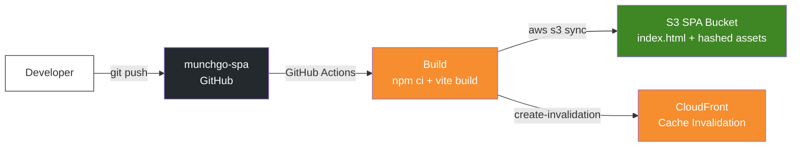
```mermaid
graph LR
    DEV2[Developer] -->|git push| SPA_REPO["munchgo-spa<br/>GitHub"]
    SPA_REPO -->|GitHub Actions| BUILD2["Build<br/>npm ci + vite build"]
    BUILD2 -->|aws s3 sync| S3_2["S3 SPA Bucket<br/>index.html + hashed assets"]
    BUILD2 -->|create-invalidation| CF2["CloudFront<br/>Cache Invalidation"]

    style DEV2 fill:#fff,stroke:#333,color:#333
    style SPA_REPO fill:#24292E,color:#fff
    style BUILD2 fill:#F68D2E,color:#fff
    style S3_2 fill:#3F8624,color:#fff
    style CF2 fill:#F68D2E,color:#fff
```

1. Developer pushes code to `munchgo-spa`
2. **GitHub Actions** runs `npm ci`, `npm run lint`, `npm run build`
3. Built assets are uploaded to **S3** via `aws s3 sync` (hashed assets with 1-year cache, `index.html` with no-cache)
4. **CloudFront cache invalidation** ensures the latest version is served immediately
5. GitHub Actions authenticates to AWS via **OIDC federation** — no stored AWS credentials

### ArgoCD Sync Wave Ordering


```mermaid
gantt
    title ArgoCD Sync Wave Deployment Order
    dateFormat X
    axisFormat %s

    section Infrastructure
    Gateway API CRDs (wave -2)          :a1, 0, 1
    Istio Base CRDs (wave -1)           :a2, 1, 2
    istiod + CNI + ztunnel (wave 0)     :a3, 2, 3
    Namespaces (wave 1)                 :a4, 3, 4

    section Service Mesh
    Istio Gateway + NLB (wave 5)        :b1, 4, 5
    HTTPRoutes (wave 6)                 :b2, 5, 6

    section Applications
    Platform Apps (wave 7)              :c1, 6, 7
    External Secrets + MunchGo (wave 8) :c2, 7, 8
    SecretStore Config (wave 9)         :c3, 8, 9

    section Mesh Policies
    Waypoint + AuthZ + mTLS (wave 10)   :d1, 9, 10

    section Observability
    Prometheus + Grafana (wave 11)      :e1, 10, 11
    Kiali + Jaeger (wave 12)            :e2, 11, 12
```

| Wave | Application | What Gets Deployed |
|------|-------------|-------------------|
| -2 | gateway-api-crds | `Gateway`, `HTTPRoute`, `ReferenceGrant` CRDs |
| -1 | istio-base | Istio CRDs and cluster-wide resources |
| 0 | istiod, istio-cni, ztunnel | Ambient mesh control + data plane |
| 1 | namespaces | `munchgo`, `external-secrets`, `observability` (ambient labeled) |
| 5 | gateway | Istio Gateway → creates single internal NLB |
| 6 | httproutes | `/api/v1/auth`, `/api/v1/consumers`, `/api/v1/restaurants`, `/api/v1/orders`, `/api/v1/couriers`, `/api/v1/sagas` |
| 7 | platform-apps | health-responder |
| 8 | external-secrets, munchgo-apps | ESO Helm chart + MunchGo services (from GitOps repo) |
| 9 | external-secrets-config | ClusterSecretStore + ExternalSecrets (DB credentials) |
| 10 | istio-mesh-policies | Waypoint proxy, AuthorizationPolicy, PeerAuthentication, Telemetry |
| 11 | prometheus-stack | kube-prometheus-stack + Grafana dashboards |
| 12 | kiali, jaeger | Service mesh dashboard + distributed tracing |

### Architecture Layers

System nodes handle critical add-ons (tainted with `CriticalAddonsOnly`), while User nodes run application workloads. DaemonSets (istio-cni, ztunnel) run on **all** nodes via tolerations.

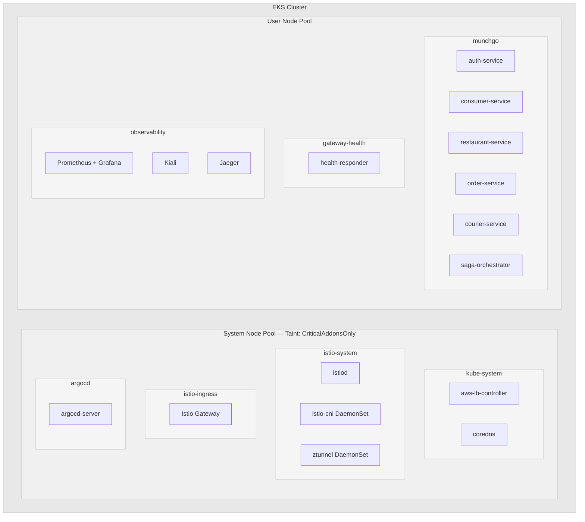
```mermaid
flowchart TB
    subgraph EKS["EKS Cluster"]
        subgraph SystemPool["System Node Pool — Taint: CriticalAddonsOnly"]
            subgraph KS["kube-system"]
                LBC2[aws-lb-controller]
                CoreDNS[coredns]
            end
            subgraph IS["istio-system"]
                Istiod2[istiod]
                CNI2[istio-cni DaemonSet]
                ZT2[ztunnel DaemonSet]
            end
            subgraph II["istio-ingress"]
                GW2[Istio Gateway]
            end
            subgraph AC["argocd"]
                ArgoServer[argocd-server]
            end
        end

        subgraph UserPool["User Node Pool"]
            subgraph MG["munchgo"]
                Auth[auth-service]
                Consumer[consumer-service]
                Restaurant[restaurant-service]
                Order[order-service]
                Courier[courier-service]
                Saga[saga-orchestrator]
            end
            subgraph GH["gateway-health"]
                HealthResp[health-responder]
            end
            subgraph OBS["observability"]
                Prom[Prometheus + Grafana]
                Kiali2[Kiali]
                Jaeger2[Jaeger]
            end
        end
    end

    style EKS fill:#E8E8E8,stroke:#999,color:#333
    style SystemPool fill:#F0F0F0,stroke:#BBB,color:#333
    style UserPool fill:#F0F0F0,stroke:#BBB,color:#333
    style KS fill:#F5F5F5,stroke:#CCC,color:#333
    style IS fill:#F5F5F5,stroke:#CCC,color:#333
    style II fill:#F5F5F5,stroke:#CCC,color:#333
    style AC fill:#F5F5F5,stroke:#CCC,color:#333
    style MG fill:#F5F5F5,stroke:#CCC,color:#333
    style GH fill:#F5F5F5,stroke:#CCC,color:#333
    style OBS fill:#F5F5F5,stroke:#CCC,color:#333
```

---

## Prerequisites

- AWS CLI configured with credentials
- Terraform >= 1.5
- kubectl + Helm 3
- [decK CLI](https://docs.konghq.com/deck/latest/)
- [Kong Konnect](https://konghq.com/products/kong-konnect) account with Dedicated Cloud Gateway entitlement

---

## Deployment

Eight steps, zero manual console clicks. Terraform handles infrastructure in two phases (CloudFront depends on the Kong proxy URL from Step 5), ArgoCD syncs K8s resources, and scripts automate Konnect + Cognito setup.

### Deployment Layers

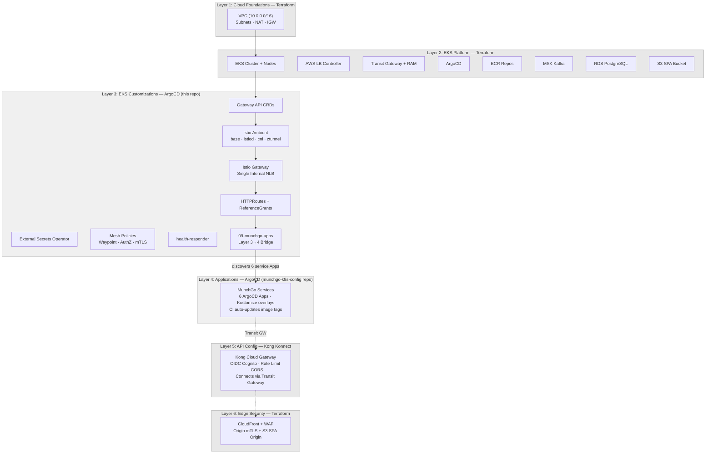
```mermaid
graph TB
    subgraph L1 ["Layer 1: Cloud Foundations — Terraform"]
        VPC["VPC (10.0.0.0/16)<br/>Subnets · NAT · IGW"]
    end

    subgraph L2 ["Layer 2: EKS Platform — Terraform"]
        EKS2[EKS Cluster + Nodes]
        LBC3[AWS LB Controller]
        TGW3[Transit Gateway + RAM]
        ArgoCD3[ArgoCD]
        ECR2[ECR Repos]
        MSK3[MSK Kafka]
        RDS3[RDS PostgreSQL]
        SPA[S3 SPA Bucket]
    end

    subgraph L3 ["Layer 3: EKS Customizations — ArgoCD (this repo)"]
        CRDs2[Gateway API CRDs]
        Istio2["Istio Ambient<br/>base · istiod · cni · ztunnel"]
        GW3["Istio Gateway<br/>Single Internal NLB"]
        Routes2[HTTPRoutes + ReferenceGrants]
        ESO[External Secrets Operator]
        MeshPol["Mesh Policies<br/>Waypoint · AuthZ · mTLS"]
        HealthApp[health-responder]
        BRIDGE["09-munchgo-apps<br/>Layer 3→4 Bridge"]
    end

    subgraph L4 ["Layer 4: Applications — ArgoCD (munchgo-k8s-config repo)"]
        MunchGoApps["MunchGo Services<br/>6 ArgoCD Apps · Kustomize overlays<br/>CI auto-updates image tags"]
    end

    subgraph L5 ["Layer 5: API Config — Kong Konnect"]
        KongGW2["Kong Cloud Gateway<br/>OIDC Cognito · Rate Limit · CORS<br/>Connects via Transit Gateway"]
    end

    subgraph L6 ["Layer 6: Edge Security — Terraform"]
        CFront2["CloudFront + WAF<br/>Origin mTLS + S3 SPA Origin"]
    end

    VPC --> EKS2
    EKS2 --> CRDs2
    CRDs2 --> Istio2
    Istio2 --> GW3
    GW3 --> Routes2
    Routes2 --> BRIDGE
    BRIDGE -->|discovers 6 service Apps| MunchGoApps
    MunchGoApps -.->|Transit GW| KongGW2
    KongGW2 -.-> CFront2

    style L1 fill:#E8E8E8,stroke:#999,color:#333
    style L2 fill:#E8E8E8,stroke:#999,color:#333
    style L3 fill:#F0F0F0,stroke:#BBB,color:#333
    style L4 fill:#F0F0F0,stroke:#BBB,color:#333
    style L5 fill:#E8E8E8,stroke:#999,color:#333
    style L6 fill:#E8E8E8,stroke:#999,color:#333
```

### Step 1: Configure Konnect Credentials

```bash
cp .env.example .env
```

Edit `.env` — only **3 values** needed:

```bash
KONNECT_REGION="au"
KONNECT_TOKEN="kpat_your_token_here"
KONNECT_CONTROL_PLANE_NAME="kong-cloud-gateway-eks"
```

> `.env` is **gitignored** — your token never gets committed. All scripts auto-source it.

### Step 2: Deploy Infrastructure + GitOps

```bash
terraform -chdir=terraform init
terraform -chdir=terraform apply
```

This creates Layers 1-3 in one shot:
- VPC, EKS cluster, node groups (system + user), AWS LB Controller, Transit Gateway + RAM share
- **ECR** (6 repositories), **MSK** (Kafka), **RDS** (PostgreSQL + 6 databases), **S3** (SPA bucket)
- **Amazon Cognito** — User Pool, App Client, User Pool Groups, Pre Token Generation Lambda, Secrets Manager entries
- ArgoCD + **root application** (App of Apps) — bootstrapped automatically

ArgoCD immediately begins syncing all Layer 3 child apps via **sync waves** in dependency order (see table above). The `09-munchgo-apps.yaml` bridge app (sync wave 8) discovers Layer 4 service Applications from the `munchgo-k8s-config` GitOps repo.

> CloudFront + WAF (Layer 6) is deployed in Step 8 after the Kong proxy URL is available.

### Step 3: Configure kubectl

```bash
aws eks update-kubeconfig \
  --name $(terraform -chdir=terraform output -raw cluster_name) \
  --region ap-southeast-2
```

### Step 4: Generate TLS Certificates

```bash
./scripts/01-generate-certs.sh
```

Generates a self-signed CA + server certificate and **automatically creates** the `istio-gateway-tls` Kubernetes secret.

### Step 5: Set Up Kong Cloud Gateway

```bash
./scripts/02-setup-cloud-gateway.sh
```

Fully automates Konnect and AWS setup:
1. Creates Konnect control plane (`cloud_gateway: true`)
2. Provisions Cloud Gateway network (~30 minutes)
3. Shares Transit Gateway via AWS RAM
4. Auto-accepts TGW attachment

### Step 6: Populate Config Placeholders

```bash
./scripts/03-post-terraform-setup.sh
```

This script **automatically reads all Terraform outputs** and populates every placeholder across the deployment:

| File | Placeholders Replaced |
|------|----------------------|
| `deck/kong.yaml` | `PLACEHOLDER_NLB_DNS`, `PLACEHOLDER_COGNITO_ISSUER_URL` |
| `k8s/external-secrets/munchgo-cognito-secret.yaml` | `PLACEHOLDER-munchgo-cognito` |
| `k8s/external-secrets/munchgo-db-secret.yaml` | All 7 `PLACEHOLDER-munchgo-*-db` secrets |
| `munchgo-k8s-config/overlays/dev/auth-service/kustomization.yaml` | `COGNITO_AUTH_SERVICE_ROLE_ARN` |

The script also:
- **Creates the Kafka config secret** from MSK bootstrap brokers (for services to connect to MSK)
- **Syncs Kong routes to Konnect** via `deck gateway sync` (requires `KONNECT_TOKEN` in `.env`)
- **Seeds the default admin user** (`admin@munchgo.com` / `Admin@123`) in Cognito and the auth-service database. To run it separately: `./scripts/04-seed-admin-user.sh`.

> The script waits for the Istio Gateway NLB to be provisioned before replacing `PLACEHOLDER_NLB_DNS`. If the NLB isn't ready, it skips that placeholder and you can re-run the script later.

### Step 7: Commit & Push Populated Config

Commit the populated files so ArgoCD picks up the ExternalSecret changes:

```bash
git add deck/kong.yaml k8s/external-secrets/
git commit -m "Populate deployment placeholders from terraform outputs"
git push
```

### Step 8: Deploy CloudFront + WAF

Get the **Public Edge DNS** from Konnect UI → Gateway Manager → Connect.

```hcl
# terraform/terraform.tfvars
kong_cloud_gateway_domain = "<hash>.aws-ap-southeast-2.edge.gateways.konggateway.com"
```

```bash
terraform -chdir=terraform apply
```

> **CloudFront is mandatory** — WAF rules protect against OWASP Top 10, bot traffic, and DDoS. The CloudFront→Kong origin uses mTLS to prevent bypassing edge security.

### Access URL

After Step 8 completes, your application URL is the CloudFront distribution domain:

```bash
export APP_URL=$(terraform -chdir=terraform output -raw application_url)
echo "Application URL: $APP_URL"
```

All API traffic must flow through CloudFront → WAF → Kong Cloud Gateway → Istio mesh:

```
Client → CloudFront (WAF) → Kong Cloud Gateway (OIDC) → Transit GW → NLB → Istio Gateway → Services
```

### Generate a Test Token (Optional)

```bash
./scripts/02-generate-jwt.sh
```

Registers a test user in Cognito and returns access/ID/refresh tokens. Use the access token to test protected APIs:

```bash
curl -H "Authorization: Bearer $ACCESS_TOKEN" $APP_URL/api/v1/orders
```

---

## API Testing — Insomnia Collection

An [Insomnia](https://insomnia.rest/) collection is included at [`insomnia/munchgo-api.json`](insomnia/munchgo-api.json) with **49+ requests** covering all MunchGo API endpoints.

### Import & Setup

1. Open Insomnia → **Import** → select `insomnia/munchgo-api.json`
2. Press `Ctrl+E` / `Cmd+E` → set `base_url` to your CloudFront domain (e.g., `https://dxxxxxxxxx.cloudfront.net`)

### One-Click Test — Collection Runner

The **"Run: Full Order Lifecycle"** folder contains 13 numbered requests that execute the complete order flow in sequence:

```
01. Health Check       → verify connectivity
02. Register User      → create test user in Cognito
03. Login              → capture tokens (auto-sets access_token)
04. Create Consumer    → auto-sets consumer_id
05. Create Restaurant  → auto-sets restaurant_id
06. Add Menu Item      → populate menu
07. Create Courier     → auto-sets courier_id
08. Set Available      → courier ready for deliveries
09. Create Order Saga  → auto-sets saga_id + order_id
10. Check Saga Status  → verify COMPLETED
11. Verify Order       → confirm order created
12. Accept Order       → restaurant accepts
13. Mark Delivered     → order lifecycle complete
```

**To run all 13 in one click:**
1. Click the **Runner** tab (top of Insomnia, next to "Debug")
2. Select the **"Run: Full Order Lifecycle"** folder
3. Click **Run** — all requests execute sequentially, passing IDs via environment variables

After-response scripts automatically chain: login captures tokens → create requests capture entity IDs → subsequent requests use those IDs.

### Collection Structure

| Folder | Endpoints | Auth | Description |
|--------|-----------|------|-------------|
| **Run: Full Order Lifecycle** | 13 | Auto-chained | One-click end-to-end test (use Runner tab) |
| **Health** | 1 | None | `/healthz` platform health check |
| **Auth Service** | 5 | None (public) | Register, login, refresh, logout, profile |
| **Consumer Service** | 8 | OIDC Bearer | CRUD + validate, activate, deactivate |
| **Restaurant Service** | 10 | OIDC + Anonymous | CRUD + menu items, validate-order |
| **Order Service (Queries)** | 6 | OIDC Bearer | Get by ID, consumer, restaurant, courier, state, history |
| **Order Service (Commands)** | 9 | OIDC Bearer | Create, approve, reject, cancel, accept, preparing, ready, picked-up, delivered |
| **Courier Service** | 8 | OIDC Bearer | CRUD + availability, activate, deactivate |
| **Saga Orchestrator** | 2 | OIDC Bearer | Create order saga, get saga status |

> **Note:** Individual service folders also contain after-response scripts for ID chaining when running requests manually.

---

## Verification

```bash
# Istio Ambient components
kubectl get pods -n istio-system

# Gateway + NLB
kubectl get gateway -n istio-ingress
kubectl get gateway -n istio-ingress kong-cloud-gw-gateway \
  -o jsonpath='{.status.addresses[0].value}'

# HTTPRoutes
kubectl get httproute -A

# MunchGo services (all pods running)
kubectl get pods -n munchgo
kubectl get svc -n munchgo

# Waypoint proxy
kubectl get gateway -n munchgo munchgo-waypoint

# Mesh policies
kubectl get peerauthentication -n munchgo
kubectl get authorizationpolicy -n munchgo

# External Secrets (all synced, no errors)
kubectl get externalsecret -n munchgo
kubectl get secret -n munchgo

# Cognito — verify secret injected
kubectl get secret munchgo-cognito-config -n munchgo -o jsonpath='{.data}' | python3 -c \
  "import sys,json,base64; d=json.load(sys.stdin); [print(f'{k}: {base64.b64decode(v).decode()}') for k,v in d.items()]"

# Auth service IRSA — verify service account annotation
kubectl get serviceaccount munchgo-auth-service -n munchgo -o yaml | grep role-arn

# End-to-end: public health check
export APP_URL=$(terraform -chdir=terraform output -raw application_url)
curl $APP_URL/healthz
curl $APP_URL/api/v1/auth/health

# End-to-end: authenticated API call
./scripts/02-generate-jwt.sh
curl -H "Authorization: Bearer $ACCESS_TOKEN" $APP_URL/api/v1/orders
```

---

## Observability

### Observability Stack

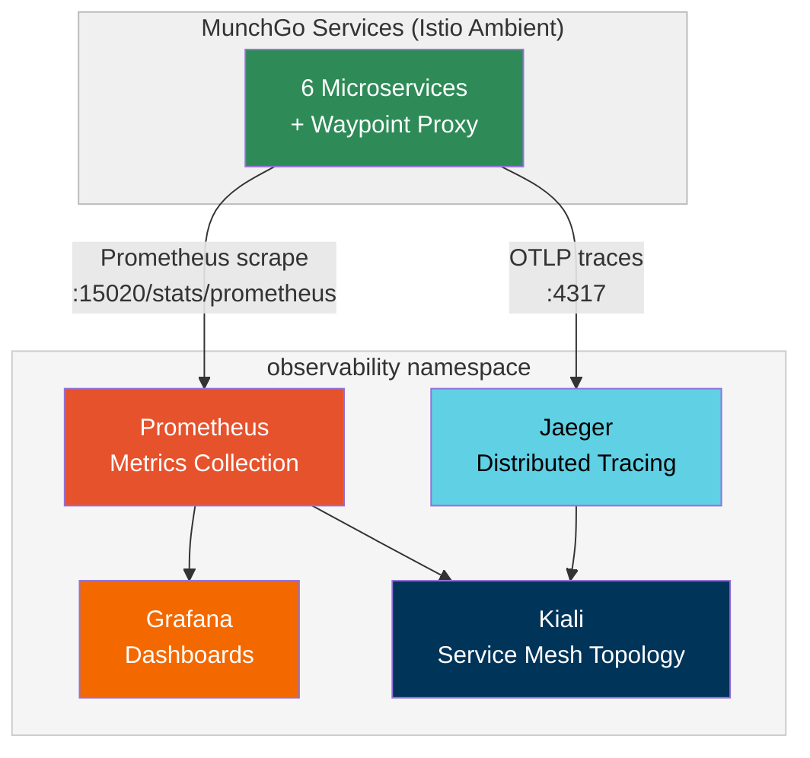
```mermaid
graph TB
    subgraph mesh_services ["MunchGo Services (Istio Ambient)"]
        SVC["6 Microservices<br/>+ Waypoint Proxy"]
    end

    subgraph obs_stack ["observability namespace"]
        PROM["Prometheus<br/>Metrics Collection"]
        GRAF["Grafana<br/>Dashboards"]
        JAEGER["Jaeger<br/>Distributed Tracing"]
        KIALI3["Kiali<br/>Service Mesh Topology"]
    end

    SVC -->|"Prometheus scrape<br/>:15020/stats/prometheus"| PROM
    SVC -->|"OTLP traces<br/>:4317"| JAEGER
    PROM --> GRAF
    PROM --> KIALI3
    JAEGER --> KIALI3

    style SVC fill:#2E8B57,color:#fff
    style PROM fill:#E6522C,color:#fff
    style GRAF fill:#F46800,color:#fff
    style JAEGER fill:#60D0E4,color:#000
    style KIALI3 fill:#003459,color:#fff
    style mesh_services fill:#F0F0F0,stroke:#BBB,color:#333
    style obs_stack fill:#F5F5F5,stroke:#CCC,color:#333
```

| Tool | Access | Purpose |
|------|--------|---------|
| **Grafana** | `kubectl port-forward svc/prometheus-stack-grafana -n observability 3000:80` | Metrics dashboards (Istio, K8s, MunchGo) |
| **Kiali** | `kubectl port-forward svc/kiali -n observability 20001:20001` | Service mesh topology, traffic flow visualization |
| **Jaeger** | `kubectl port-forward svc/jaeger-query -n observability 16686:16686` | Distributed traces across microservices |
| **Prometheus** | `kubectl port-forward svc/prometheus-stack-kube-prom-prometheus -n observability 9090:9090` | Raw metrics queries (PromQL) |

### ArgoCD UI

```bash
terraform -chdir=terraform output -raw argocd_admin_password
kubectl port-forward svc/argocd-server -n argocd 8080:80
# Open http://localhost:8080 (user: admin)
```

---

## Konnect UI

Once deployed, everything is visible at [cloud.konghq.com](https://cloud.konghq.com):

| Feature | Where in Konnect UI |
|---------|-------------------|
| **API Analytics** | Analytics → Dashboard (request counts, latency P50/P95/P99, error rates) |
| **Gateway Health** | Gateway Manager → Data Plane Nodes (status, connections) |
| **Routes & Services** | Gateway Manager → Routes / Services |
| **Plugins** | Gateway Manager → Plugins (OpenID Connect, rate limiting, CORS, transforms) |

---

## Teardown

```bash
./scripts/destroy.sh
```

Tears down the **full stack** in the correct order:

1. **Delete Istio Gateway** → triggers NLB deprovisioning
2. **Wait for NLB/ENI cleanup** → prevents VPC deletion failures
3. **Delete ArgoCD apps** → cascade removes all workloads
4. **Cleanup CRDs** → removes Gateway API and Istio CRDs
5. **Terraform destroy** → removes EKS, VPC, TGW, RAM, ECR, MSK, RDS, S3, CloudFront + WAF
6. **Cleanup CloudFormation stacks** → safety net for orphaned CFN
7. **Delete Konnect resources** → removes Cloud Gateway via API

---

## Terraform Variables Reference

| Variable | Default | Description |
|----------|---------|-------------|
| `region` | `ap-southeast-2` | AWS region |
| `environment` | `poc` | Environment name |
| `project_name` | `kong-gw` | Project name prefix |
| `vpc_cidr` | `10.0.0.0/16` | VPC CIDR block |
| `kubernetes_version` | `1.29` | EKS Kubernetes version |
| `eks_node_instance_type` | `t3.medium` | System node instance type |
| `user_node_instance_type` | `t3.medium` | User node instance type |
| `enable_ecr` | `true` | Create ECR repositories |
| `enable_msk` | `true` | Create MSK Kafka cluster |
| `msk_instance_type` | `kafka.m5.large` | MSK broker instance type |
| `msk_broker_count` | `2` | Number of Kafka brokers |
| `enable_rds` | `true` | Create RDS PostgreSQL |
| `rds_instance_class` | `db.t3.medium` | RDS instance class |
| `rds_multi_az` | `false` | Multi-AZ for production |
| `enable_spa` | `true` | Create S3 SPA bucket |
| `enable_external_secrets` | `true` | External Secrets IRSA |
| `enable_cognito` | `true` | Amazon Cognito User Pool + IRSA |
| `enable_cloudfront` | `true` | CloudFront + WAF |
| `kong_cloud_gateway_domain` | `""` | Kong proxy domain (from Konnect) |
| `enable_waf` | `true` | WAF Web ACL |
| `waf_rate_limit` | `2000` | Requests per 5 min per IP |

---

## Appendix

### CloudFront Origin mTLS — Terraform Workaround

**Problem:** The Terraform AWS provider (as of v6.31) does **not** support `origin_mtls_config` on the `aws_cloudfront_distribution` resource.

**Workaround:** The CloudFront distribution is created via `aws_cloudformation_stack` instead of the native resource, which supports `OriginMtlsConfig` with `ClientCertificateArn`.

See: [`terraform/modules/cloudfront/main.tf`](terraform/modules/cloudfront/main.tf)

**Migration path** (once Terraform provider adds support):
1. Replace `aws_cloudformation_stack.cloudfront` with native `aws_cloudfront_distribution`
2. `terraform state rm` + `terraform import`
3. Delete orphaned CloudFormation stack
