# MunchGo IaC — Monolith to Microservices on AWS

This is the **Infrastructure as Code (IaC) repository** for deploying the modernised **MunchGo food-delivery application** on AWS. The [MunchGo monolith](https://github.com/shanaka-versent/munchgo-monolith) has been decomposed into [6 Spring Boot microservices](https://github.com/shanaka-versent/munchgo-microservices) — auth, consumer, restaurant, order, courier, and saga-orchestrator — with a [React SPA](https://github.com/shanaka-versent/munchgo-spa) replacing the Thymeleaf frontend.

**Microservices** run on **Amazon EKS** with **Istio Ambient Mesh** for automatic mTLS and L7 authorization (no sidecars). APIs are exposed through **Kong Dedicated Cloud Gateway** (fully managed in Kong's AWS account, connected via Transit Gateway) and protected by **Amazon CloudFront + WAF** with origin mTLS. Authentication is handled by **Amazon Cognito** (OIDC) validated at the Kong gateway layer — microservices receive pre-validated identity headers with zero token logic.

**The SPA** is deployed to **Amazon S3** and served through the same **CloudFront distribution** — hashed assets get immutable 1-year caching while `index.html` is always fresh.

The underlying platform pattern — Kong Cloud Gateway, EKS, Istio Gateway API, Transit Gateway private networking, CloudFront + WAF, and the full deployment automation — is documented in the [Kong Dedicated Cloud Gateway on EKS with Istio Gateway API (Ambient Mesh)](https://github.com/shanaka-versent/Kong-Konnect-Cloud-Gateway-on-EKS) repo. **This README focuses on what's built on top**: the MunchGo application, Cognito authentication, event-driven sagas, CI/CD pipelines, and observability.

---

## Table of Contents

- [Architecture](#architecture)
  - [Traffic Flow](#traffic-flow)
  - [Istio Ambient Service Mesh](#istio-ambient-service-mesh)
  - [East-West Traffic](#east-west-traffic--how-services-communicate)
  - [Private Connectivity](#private-connectivity)
  - [Security Layers](#security-layers)
  - [Defence-in-Depth: Kubernetes Network Policy](#defence-in-depth-kubernetes-network-policy)
- [MunchGo Microservices](#munchgo-microservices)
  - [Service Details](#service-details)
  - [Authentication — Amazon Cognito + OIDC](#authentication--amazon-cognito--oidc)
  - [Order Saga Flow](#order-saga-flow)
  - [MunchGo React SPA](#munchgo-react-spa)
  - [Business Logic — Role-Based Access](#business-logic--role-based-access)
- [GitOps & CI/CD Pipeline](#gitops--cicd-pipeline)
  - [Container Registry & Microservices Pipeline](#container-registry--microservices-pipeline)
  - [SPA Deployment](#spa-deployment)
  - [GitHub Actions Secrets & Variables](#github-actions-secrets--variables)
  - [ArgoCD Sync Wave Ordering](#argocd-sync-wave-ordering)
- [API Testing](#api-testing)
  - [Insomnia Collection](#insomnia-collection)
  - [Automated Post-Deployment Testing](#automated-post-deployment-testing)
- [Prerequisites](#prerequisites)
- [Deployment](#deployment)
- [Verification](#verification)
- [Observability](#observability)
  - [Grafana, Prometheus & Tracing](#grafana-prometheus--tracing)
  - [Istio Dashboards](#istio-dashboards)
  - [Kong Konnect Monitoring](#kong-konnect-monitoring)
  - [Konnect UI](#konnect-ui)
  - [ArgoCD UI](#argocd-ui)
- [Teardown](#teardown)
- [Terraform Variables Reference](#terraform-variables-reference)
- [Appendix](#appendix)

---

## Architecture

### High-Level Overview

Two AWS accounts are involved. Traffic never touches the public internet between Kong and EKS. MunchGo microservices communicate east-west via Istio Ambient mTLS and north-south through Kong Cloud Gateway.


**TLS terminates and re-encrypts at each trust boundary — traffic is encrypted at every hop:**

| Hop | Protocol | Terminates At |
|-----|----------|---------------|
| Client → CloudFront | TLS 1.2/1.3 (AWS-managed cert) | CloudFront edge |
| CloudFront → Kong | TLS + Origin mTLS client certificate | Kong Cloud Gateway |
| Kong → NLB (via TGW) | TLS (private AWS backbone via Transit GW) | Istio Gateway |
| NLB → Istio Gateway | TLS passthrough (NLB L4) | Istio Gateway (port 443) |
| Istio Gateway → Pod | Istio Ambient mTLS (ztunnel L4) | Backend pod |

### Traffic Flow

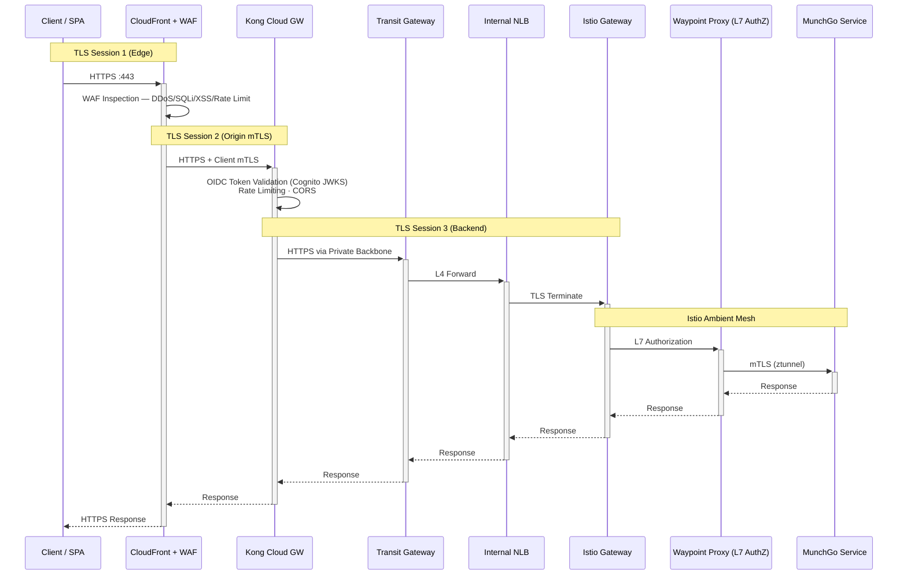

### Istio Ambient Service Mesh

MunchGo uses **Istio Ambient Mesh** — zero sidecar containers. L4 mTLS is handled by **ztunnel** (DaemonSet on every node). L7 policies are enforced by a **waypoint proxy** per namespace.


| Component | Role | Scope |
|-----------|------|-------|
| **ztunnel** | L4 mTLS proxy (DaemonSet) | Automatic — encrypts all pod-to-pod traffic |
| **Waypoint** | L7 proxy (per namespace) | AuthorizationPolicy, telemetry, traffic management |
| **PeerAuthentication** | mTLS mode | `STRICT` — all traffic must be mTLS |
| **AuthorizationPolicy** | Access control | Restricts saga-orchestrator, allows gateway ingress |
| **Telemetry** | Observability | Jaeger tracing (100%), Prometheus metrics, access logs |

### East-West Traffic — How Services Communicate

MunchGo uses a **hybrid communication model**: synchronous HTTP calls for saga orchestration (protected by Istio mTLS) and asynchronous Kafka events for domain events (via external MSK).

**Only the Saga Orchestrator makes direct HTTP calls to other services.** All other services communicate exclusively via Kafka. Istio authorization policies enforce this — only authorized sources can reach each service regardless of ClusterIP accessibility.


When the Saga Orchestrator calls the Consumer Service:

```
Saga Pod → ztunnel (mTLS encrypt) → Waypoint (L7 AuthZ check) → ztunnel (mTLS decrypt) → Consumer Pod
```

| Source | Target | Protocol | Path / Topic | Istio mTLS? |
|--------|--------|----------|-------------|-------------|
| **Saga Orchestrator** | Consumer Service | HTTP POST | `/api/v1/consumers/{id}/validate` | Yes |
| **Saga Orchestrator** | Restaurant Service | HTTP GET | `/api/v1/restaurants/{id}` | Yes |
| **Saga Orchestrator** | Order Service | HTTP POST/PUT | `/api/v1/orders`, `/api/v1/orders/{id}/approve` | Yes |
| **Saga Orchestrator** | Courier Service | Kafka | `saga-commands` topic | No (external MSK) |
| Courier Service | Saga Orchestrator | Kafka | `saga-replies` topic | No (external MSK) |
| Auth Service | Consumer/Courier Service | Kafka | `user-events` topic | No (external MSK) |
| Istio Gateway | All services | HTTP | HTTPRoute path-based routing | Yes (ztunnel) |

**Istio Authorization Policies (Least Privilege):**

| Policy | What It Does |
|--------|-------------|
| `allow-gateway-ingress-l4` | L4 — Istio Gateway can reach all backend services |
| `allow-intra-munchgo-l4` | L4 — east-west traffic between services within the munchgo namespace |
| `allow-saga-orchestrator` | Saga Orchestrator service account can call Consumer, Restaurant, Order, Courier |
| `restrict-saga-orchestrator` | Saga Orchestrator reachable from within munchgo namespace + Istio Gateway only |
| `allow-health-checks` | Any source can reach `/actuator/health/*` (for K8s probes) |

Kafka traffic bypasses Istio entirely — MSK runs outside the cluster in dedicated AWS-managed infrastructure.

### Private Connectivity

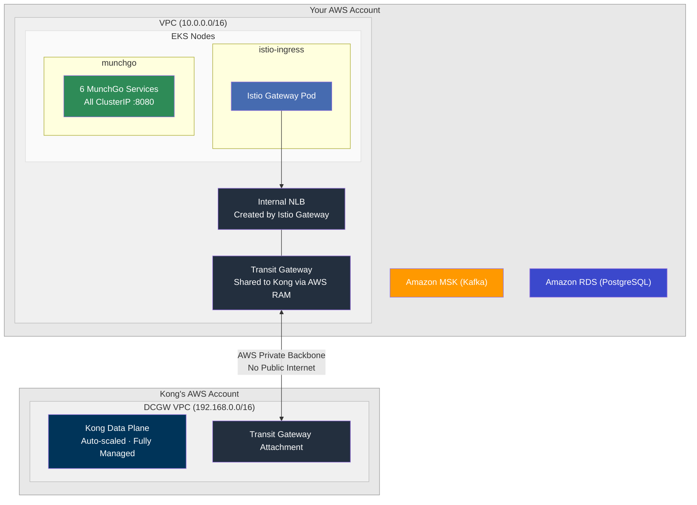

All Transit Gateway setup is automated — Terraform creates the TGW and route tables, the setup script fetches Kong's AWS account ID from Konnect, adds it as a RAM principal, and accepts the attachment. No manual AWS Console steps needed.

### Security Layers

| Layer | Component | Protection |
|-------|-----------|------------|
| 1 | CloudFront + WAF | DDoS, SQLi/XSS, rate limiting, geo-blocking |
| 2 | Origin mTLS | CloudFront bypass prevention (via CloudFormation) |
| 3 | Kong Plugins | OpenID Connect (Cognito JWKS), per-route rate limiting, CORS, request transform, Prometheus metrics |
| 4 | Transit Gateway | Private connectivity — backends never exposed publicly |
| 5 | Istio Ambient mTLS | Automatic L4 encryption between all mesh pods (ztunnel) |
| 6 | Waypoint AuthZ | L7 authorization policies for east-west traffic |
| 7 | PeerAuthentication | Strict mTLS enforcement — no plaintext allowed |
| 8 | ClusterIP Services | No direct external access to backend services |
| 9 | External Secrets | AWS Secrets Manager → K8s Secrets via IRSA (no hardcoded credentials) |
| 10 | Kubernetes NetworkPolicy | VPC CNI eBPF enforcement — kernel-level L3/L4 backstop independent of Istio |

### Defence-in-Depth: Kubernetes Network Policy

#### Why NetworkPolicy in addition to Istio?

Istio Ambient Mesh enforces mTLS and authorization by intercepting pod traffic via iptables redirect. This is effective, but has edge cases:

- **Same-node shortcuts** — in some CNI configurations, pod-to-pod traffic on the same node can bypass the iptables redirect before ztunnel sees it.
- **Compromised node** — a node-level attacker with `NET_ADMIN` capability can manipulate iptables rules, bypassing ztunnel entirely.
- **iptables drift** — race conditions during pod startup or CNI reinit can temporarily leave pods without ztunnel interception.

Kubernetes `NetworkPolicy` resources, enforced by the **VPC CNI NetworkPolicy controller** (eBPF-based), operate at the kernel level **independently of Istio**. They drop packets before the pod's network stack sees them — unaffected by iptables manipulation or ztunnel state.

**Two independent enforcement layers an attacker must bypass simultaneously:**

```
Packet from unauthorized source
         │
         ▼
┌─────────────────────────────┐
│  VPC CNI NetworkPolicy      │  ← Layer 1: kernel/eBPF drops packet
│  (independent of Istio)     │    if source namespace/IP not allowed
└─────────────────────────────┘
         │ (only if CNI allows it)
         ▼
┌─────────────────────────────┐
│  Istio ztunnel (HBONE mTLS) │  ← Layer 2: rejects non-mTLS or
│  + Waypoint AuthorizationPolicy│  unauthorized service identity
└─────────────────────────────┘
         │ (only if mesh allows it)
         ▼
         Pod
```

#### What is enforced

**`munchgo` namespace:**

| Policy | Direction | What it allows |
|--------|-----------|----------------|
| `default-deny-ingress` | Ingress | Blocks everything — only explicit allows below |
| `default-deny-egress` | Egress | Blocks everything — only explicit allows below |
| `allow-ingress-from-istio-gateway` | Ingress | Istio Gateway (istio-ingress ns) can reach all munchgo pods |
| `allow-ingress-intra-namespace` | Ingress | Pods within `munchgo` can reach each other (saga → services) |
| `allow-ingress-from-observability` | Ingress | Prometheus can scrape `/actuator/prometheus` |
| `allow-kubelet-probes` | Ingress | Kubelet health checks from VPC node IPs (`10.0.0.0/16`) |
| `allow-egress-intra-namespace` | Egress | Pods within `munchgo` can call each other |
| `allow-egress-dns` | Egress | CoreDNS port 53 for service discovery |
| `allow-egress-aws-data-services` | Egress | MSK Kafka (`:9094`) and RDS PostgreSQL (`:5432`) within VPC |
| `allow-egress-external-https` | Egress | Public HTTPS (`:443`) only — for Cognito JWKS auto-discovery |

**`istio-ingress` namespace (Kong traffic entry point):**

| Policy | Direction | What it allows |
|--------|-----------|----------------|
| `default-deny-ingress` | Ingress | Blocks all except Kong and VPC health checks |
| `default-deny-egress` | Egress | Blocks all except munchgo, gateway-health, and DNS |
| `allow-ingress-from-kong` | Ingress | Kong Cloud Gateway CIDR `192.168.0.0/16` + VPC `10.0.0.0/16` (NLB health checks) |
| `allow-egress-to-backends` | Egress | `munchgo` and `gateway-health` namespaces + DNS |

#### Deployment & Verification

NetworkPolicies are managed by ArgoCD (sync wave 11) from `k8s/network-policies/network-policies.yaml`. The VPC CNI NetworkPolicy controller is enabled via Terraform (`terraform/modules/eks/addons.tf`) with `enableNetworkPolicy: true`.

> **Note:** In VPC CNI v1.14+, the enforcement agent (`aws-eks-nodeagent`) runs as a **sidecar inside `aws-node`** — look for `2/2 READY`, not a separate `aws-network-policy-agent` DaemonSet.

```bash
# Confirm enforcement agent running on every node (look for 2/2 READY)
kubectl get pods -n kube-system -l k8s-app=aws-node

# Confirm NetworkPolicies applied
kubectl get networkpolicies -n munchgo
kubectl get networkpolicies -n istio-ingress

# Confirm VPC CNI addon has NetworkPolicy enabled
kubectl get configmap -n kube-system amazon-vpc-cni \
  -o jsonpath='{.data.enable-network-policy}'
```

---

## MunchGo Microservices

A food delivery platform built with Java 21 + Spring Boot, following event-driven, CQRS, and saga orchestration patterns.


### Service Details

| Service | Port | Database | Kong Route | Auth | Pattern |
|---------|------|----------|------------|------|---------|
| **auth-service** | 8080 | munchgo_auth | `/api/v1/auth` | Public | Cognito facade |
| **consumer-service** | 8080 | munchgo_consumers | `/api/v1/consumers` | OIDC | CRUD |
| **restaurant-service** | 8080 | munchgo_restaurants | `/api/v1/restaurants` | OIDC | CRUD |
| **order-service** | 8080 | munchgo_orders | `/api/v1/orders` | OIDC | CQRS + Event Sourcing |
| **courier-service** | 8080 | munchgo_couriers | `/api/v1/couriers` | OIDC | CRUD |
| **saga-orchestrator** | 8080 | munchgo_sagas | `/api/v1/sagas` | OIDC | Saga Orchestration |

### Authentication — Amazon Cognito + OIDC

**Amazon Cognito** is the identity provider. **Only auth-service talks to Cognito** — all other services rely on Kong's upstream headers for user identity. Kong validates tokens at the edge using the **OpenID Connect** plugin with automatic JWKS discovery.

| Component | Auth Responsibility |
|-----------|-------------------|
| **Amazon Cognito** | Identity store, token issuance, JWKS endpoint, group membership |
| **auth-service** | Cognito facade — proxies register/login/refresh/logout, publishes Kafka events |
| **Kong OIDC plugin** | Token validation at the edge via JWKS, claims extraction → upstream headers |
| **Pre Token Lambda** | Injects `custom:roles` claim into access + ID tokens based on User Pool groups |
| **Other services** | Read `X-User-*` headers — zero auth logic, fully trust Kong's verification |
| **Istio mTLS** | Encrypts and authenticates all pod-to-pod traffic — separate from Cognito |

#### Registration Flow

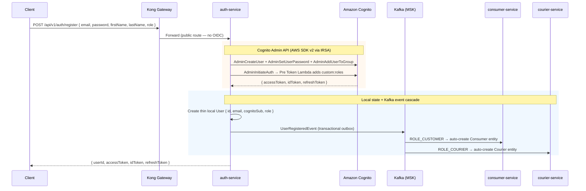

#### Authorization Flow (Protected API Call)

Kong's OIDC plugin validates the token at the edge — **no microservice auth code involved**:

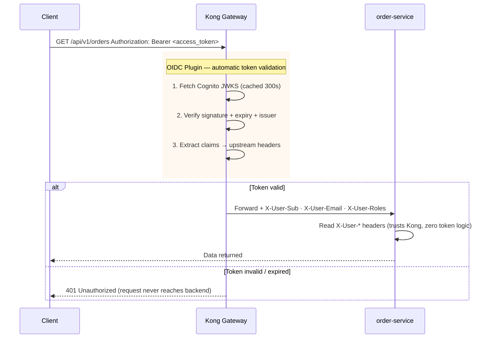

#### Token Refresh & Logout

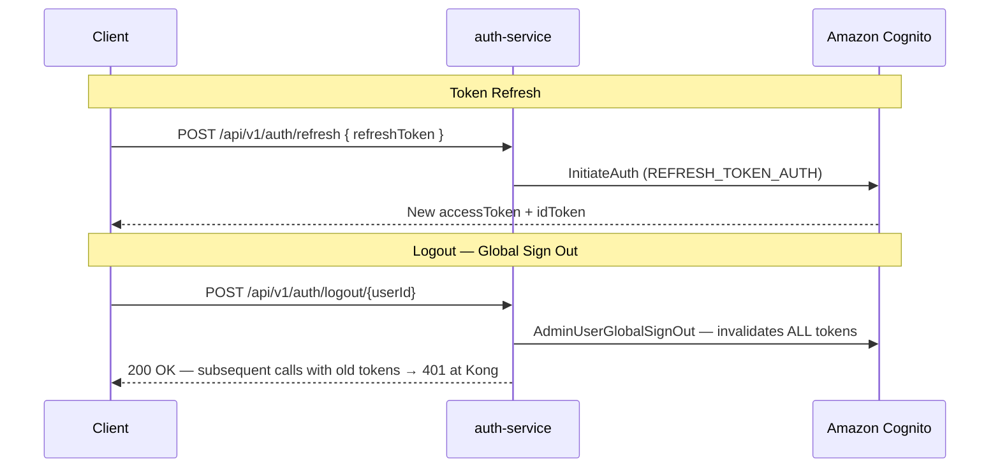

#### Cognito Configuration

- **User Pool Groups:** `ROLE_CUSTOMER`, `ROLE_RESTAURANT_OWNER`, `ROLE_COURIER`, `ROLE_ADMIN`
- **Pre Token Lambda (V2):** adds `custom:roles` claim to access + ID tokens
- **Token validity:** Access=1hr, ID=1hr, Refresh=7 days
- **Kong OIDC:** auto-discovers JWKS via `.well-known/openid-configuration`, JWKS cache TTL 300s
- **auth-service IRSA:** K8s ServiceAccount annotated with IAM role — AWS SDK picks up credentials automatically
- **Protected routes:** `/api/v1/consumers`, `/api/v1/orders`, `/api/v1/couriers`, `/api/v1/restaurants`, `/api/v1/sagas`
- **Public routes:** `/api/v1/auth/*`, `/healthz`

### Order Saga Flow

The saga orchestrator uses a **hybrid approach**: synchronous HTTP (via Istio mTLS) for validation steps, asynchronous Kafka for courier assignment. Circuit breakers (Resilience4j) protect all HTTP calls.

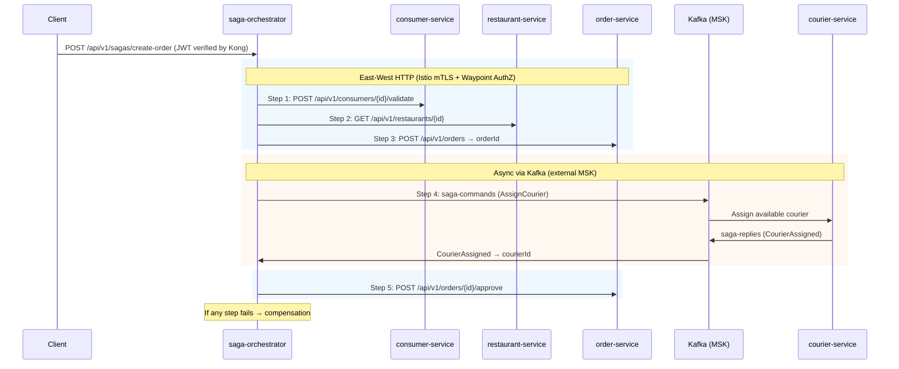

**Kafka Topics:**

| Topic | Publisher | Consumer | Purpose |
|-------|-----------|----------|---------|
| `user-events` | Auth Service | Consumer, Courier Service | Auto-create profile on user registration |
| `saga-commands` | Saga Orchestrator | Courier Service | Assign courier to order |
| `saga-replies` | Courier Service | Saga Orchestrator | Courier assignment result |

### MunchGo React SPA

React 19 + TypeScript SPA served from **S3 via CloudFront**. Static assets never touch Kong — only `/api/*` and `/healthz` requests are proxied to the gateway.

| Technology | Version | Purpose |
|-----------|---------|---------|
| React | 19 | UI framework |
| TypeScript | 5.9 | Type safety |
| Vite | 7.3 | Build tool |
| Tailwind CSS | 4.1 | Utility-first styling |
| React Router | 7.13 | Client-side routing |
| Axios | 1.13 | HTTP client with auth interceptors |

**CloudFront routing:**
- `/` and `/assets/*` → S3 (SPA with immutable asset caching)
- `/api/*` → Kong Cloud Gateway (no cache)
- `/healthz` → Kong Cloud Gateway

**Repository:** [`munchgo-spa`](https://github.com/shanaka-versent/munchgo-spa)

### Business Logic — Role-Based Access

| Role | Capabilities |
|------|-------------|
| **Guest** (unauthenticated) | Browse restaurants, view menus |
| **ROLE_CUSTOMER** | All guest capabilities + place orders, view order history, cancel approved orders |
| **ROLE_RESTAURANT_OWNER** | Approve/reject orders, manage preparation status |
| **ROLE_COURIER** | View ready pickups, mark pickup/delivery |
| **ROLE_ADMIN** | View all orders, consumers, restaurants, couriers, users |

**Order lifecycle:**
```
APPROVAL_PENDING → APPROVED → ACCEPTED → PREPARING → READY_FOR_PICKUP → PICKED_UP → DELIVERED
                ↓
            REJECTED
APPROVED → CANCELLED (customer only)
```

**Default admin user** (seeded automatically by `scripts/04-deploy-apps.sh`):

| Field | Value |
|-------|-------|
| Email | `admin@munchgo.com` |
| Password | `Admin@123` |
| Role | `ROLE_ADMIN` |

---

## GitOps & CI/CD Pipeline

### Container Registry & Microservices Pipeline

**GitHub Container Registry (GHCR)** is the single source of truth for all container images. GitHub Actions builds, tests, and pushes to GHCR. Each cloud's native registry syncs from GHCR automatically.

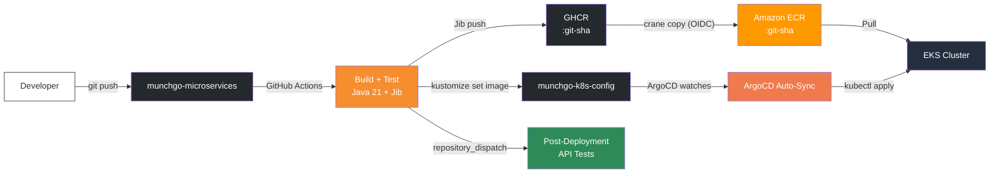

1. Developer pushes code to `munchgo-microservices`
2. **GitHub Actions** builds and tests the service (Java 21 + Maven), pushes container image to GHCR via Jib
3. `crane copy` replicates the image from GHCR to **ECR** (AWS OIDC federation — no stored credentials)
4. CI updates the **kustomize overlay** in `munchgo-k8s-config` with the new image tag
5. **ArgoCD** detects the change and auto-syncs the rolling deployment to EKS
6. After GitOps update, CI sends a `repository_dispatch` event to `munchgo-aws-iac` to trigger **post-deployment API tests**

### SPA Deployment

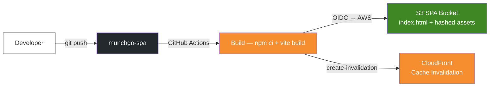

GitHub Actions authenticates via OIDC federation — no stored AWS credentials.

### GitHub Actions Secrets & Variables

**`munchgo-microservices` repo** (required for CI/CD):

| Secret/Variable | Type | Value | Used By |
|-----------------|------|-------|---------|
| `AWS_ACCOUNT_ID` | Secret | Your AWS account ID | ECR registry URL |
| `AWS_REGION` | Secret | `ap-southeast-2` | ECR region |
| `AWS_ROLE_ARN` | Secret | `arn:aws:iam::<account>:role/role-spa-deploy-kong-gw-poc` | OIDC federation (shared role) |
| `GITOPS_TOKEN` | Secret | GitHub PAT with `repo` scope on `munchgo-k8s-config` | GitOps updates + cross-repo dispatch |
| `AZURE_CLIENT_ID` | Secret | Azure AD app client ID (optional) | ACR sync via OIDC |
| `AZURE_TENANT_ID` | Secret | Azure AD tenant ID (optional) | ACR sync via OIDC |
| `AZURE_SUBSCRIPTION_ID` | Secret | Azure subscription ID (optional) | ACR sync via OIDC |
| `AZURE_ACR_NAME` | Variable | ACR name, e.g. `munchgoacr` (optional) | Conditional ACR sync |

**`munchgo-spa` repo** (auto-updated by `03-post-terraform-setup.sh`):

| Secret/Variable | Type | Value | Used By |
|-----------------|------|-------|---------|
| `AWS_ROLE_ARN` | Secret | `arn:aws:iam::<account>:role/role-spa-deploy-kong-gw-poc` | S3 upload + CloudFront invalidation |
| `AWS_REGION` | Secret | `ap-southeast-2` | AWS region |
| `SPA_BUCKET_NAME` | Secret | S3 bucket name (auto-populated) | `aws s3 sync` target |
| `CLOUDFRONT_DISTRIBUTION_ID` | Secret | CloudFront dist ID (auto-populated) | Cache invalidation |
| `CLOUDFRONT_URL` | Variable | `https://<dist>.cloudfront.net` (auto-populated) | E2E test base URL |
| `ADMIN_EMAIL` | Secret | `admin@munchgo.com` | E2E login tests |
| `ADMIN_PASSWORD` | Secret | Admin password | E2E login tests |

> **Zero-touch after rebuild:** `03-post-terraform-setup.sh` automatically updates all SPA secrets and variables from Terraform outputs. No manual GitHub UI updates needed.

**`munchgo-aws-iac` repo** (required for post-deployment tests and Terraform Konnect IaC):

| Secret | Value | Used By |
|--------|-------|---------|
| `KONNECT_TOKEN` | Konnect Personal Access Token | `deck gateway sync` (on `deck/kong.yaml` push) · `TF_VAR_konnect_token` in Terraform CI runs |

When running `terraform apply` in CI, expose the token as:
```yaml
env:
  TF_VAR_konnect_token: ${{ secrets.KONNECT_TOKEN }}
```
This creates the Konnect control plane, network, and data plane group declaratively — no separate scripts or manual steps.

The IAM role `role-spa-deploy-kong-gw-poc` is created by Terraform (`terraform/modules/iam/github_oidc.tf`). It trusts both `munchgo-spa` and `munchgo-microservices` repos via GitHub OIDC federation.

### ArgoCD Sync Wave Ordering

```mermaid
gantt
    title ArgoCD Sync Wave Deployment Order
    dateFormat X
    axisFormat %s

    section Infrastructure
    Gateway API CRDs (wave -2)          :a1, 0, 1
    Istio Base CRDs (wave -1)           :a2, 1, 2
    istiod + CNI + ztunnel (wave 0)     :a3, 2, 3
    Namespaces (wave 1)                 :a4, 3, 4

    section Service Mesh
    Istio Gateway + NLB (wave 5)        :b1, 4, 5
    HTTPRoutes (wave 6)                 :b2, 5, 6

    section Applications
    Platform Apps (wave 7)              :c1, 6, 7
    External Secrets + MunchGo (wave 8) :c2, 7, 8
    SecretStore Config (wave 9)         :c3, 8, 9

    section Mesh Policies + Security
    Waypoint + AuthZ + mTLS (wave 10)   :d1, 9, 10
    Prometheus + Grafana (wave 11)      :e1, 10, 11
    Network Policies (wave 11)          :e2, 10, 11
    Kiali + Jaeger + Kong Monitoring (wave 12) :e3, 11, 12
```

| Wave | Application | What Gets Deployed |
|------|-------------|-------------------|
| -2 | gateway-api-crds | `Gateway`, `HTTPRoute`, `ReferenceGrant` CRDs |
| -1 | istio-base | Istio CRDs and cluster-wide resources |
| 0 | istiod, istio-cni, ztunnel | Ambient mesh control + data plane |
| 1 | namespaces | `munchgo`, `external-secrets`, `observability` (ambient labeled) |
| 5 | gateway | Istio Gateway → creates single internal NLB |
| 6 | httproutes | All 7 API paths + `/healthz` |
| 7 | platform-apps | health-responder |
| 8 | external-secrets, munchgo-apps | ESO Helm chart + MunchGo services (from GitOps repo) |
| 9 | external-secrets-config | ClusterSecretStore + ExternalSecrets (DB credentials) |
| 10 | istio-mesh-policies | Waypoint proxy, AuthorizationPolicy, PeerAuthentication, Telemetry |
| 11 | prometheus-stack, network-policies | kube-prometheus-stack + Grafana + Kubernetes NetworkPolicies |
| 12 | kiali, jaeger, kong-monitoring | Service mesh dashboard + distributed tracing + Kong Konnect metrics exporter |

**Architecture Layers (Node Pools):**

System nodes handle critical add-ons (tainted with `CriticalAddonsOnly`). User nodes run application workloads. DaemonSets (istio-cni, ztunnel) run on **all** nodes via tolerations.

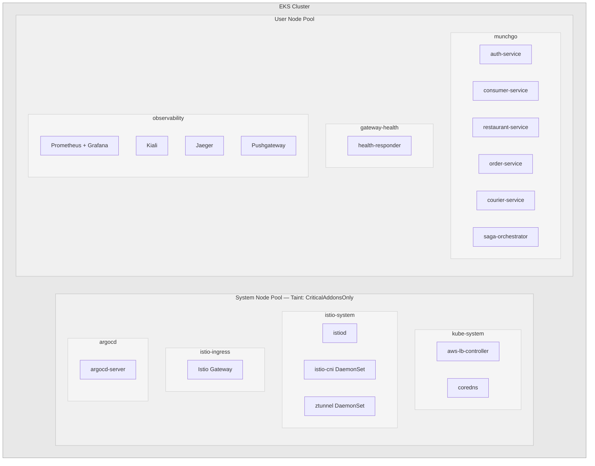

---

## API Testing

### Insomnia Collection

An [Insomnia](https://insomnia.rest/) collection is included at [`insomnia/munchgo-api.json`](insomnia/munchgo-api.json) with **49+ requests** covering all MunchGo API endpoints.

**Import:** Open Insomnia → **Import** → select `insomnia/munchgo-api.json`. The `base_url` is auto-populated by the deployment scripts (see [Step 5](#step-5-infrastructure-configuration)).

**One-Click Test — Collection Runner:**

The **"Run: Full Order Lifecycle"** folder contains 13 numbered requests that execute the complete order flow in sequence. Run them all via the **Runner** tab:

```
01. Health Check          → verify connectivity
02. Register User         → create test user in Cognito
03. Login                 → capture tokens (auto-sets access_token)
04. Create Consumer       → auto-sets consumer_id
05. Create Restaurant     → auto-sets restaurant_id
06. Add Menu Item         → populate menu
07. Create Courier        → auto-sets courier_id
08. Set Available         → courier ready for deliveries
09. Create Order Saga     → auto-sets saga_id + order_id
10. Check Saga Status     → verify COMPLETED
11. Verify Order          → confirm order created
12. Accept Order          → restaurant accepts
13. Mark Delivered        → order lifecycle complete
```

After-response scripts automatically chain IDs between requests.

**Collection Structure:**

| Folder | Endpoints | Auth | Description |
|--------|-----------|------|-------------|
| **Run: Full Order Lifecycle** | 13 | Auto-chained | One-click end-to-end test |
| **Health** | 1 | None | `/healthz` platform health check |
| **Auth Service** | 5 | None (public) | Register, login, refresh, logout, profile |
| **Consumer Service** | 8 | OIDC Bearer | CRUD + validate, activate, deactivate |
| **Restaurant Service** | 10 | OIDC + Anonymous | CRUD + menu items, validate-order |
| **Order Service (Queries)** | 6 | OIDC Bearer | Get by ID, consumer, restaurant, courier, state, history |
| **Order Service (Commands)** | 9 | OIDC Bearer | Create, approve, reject, cancel, accept, preparing, ready, picked-up, delivered |
| **Courier Service** | 8 | OIDC Bearer | CRUD + availability, activate, deactivate |
| **Saga Orchestrator** | 2 | OIDC Bearer | Create order saga, get saga status |

### Automated Post-Deployment Testing

The Insomnia collection runs automatically via GitHub Actions ([`.github/workflows/post-deployment-tests.yml`](.github/workflows/post-deployment-tests.yml)) after every deployment — no manual trigger needed.

| Trigger | When | What happens |
|---------|------|--------------|
| Push to `deck/kong.yaml` on `main` | Kong API config change | Syncs Kong via `deck gateway sync` **then** runs tests |
| `repository_dispatch: microservice-deployed` | Microservice CI confirms deploy | Polls `/healthz` until healthy, then runs full test suite |
| `workflow_dispatch` | Manual run | Optional URL override, tests run immediately |

**How it stays current:** `scripts/03-post-terraform-setup.sh` automatically writes the CloudFront URL from `terraform output application_url` into `insomnia/munchgo-api.json` on every new environment provision. No secrets or variables to update manually.

**Microservices already wired up:** A `trigger-api-tests` job is wired into all 6 microservice workflows using the existing `GITOPS_TOKEN`. After the GitOps image tag is committed, it sends a `repository_dispatch` event that wakes the `post-deployment-tests.yml` workflow, which polls `/healthz` until ArgoCD finishes the rolling deploy (~3-5 min), then runs the full test suite.

---

## Prerequisites

- AWS CLI configured with credentials
- Terraform >= 1.5
- kubectl + Helm 3
- [decK CLI](https://docs.konghq.com/deck/latest/)
- [GitHub CLI (`gh`)](https://cli.github.com/) — for CI/CD automation (repo variables, workflow triggers)
- [Kong Konnect](https://konghq.com/products/kong-konnect) account with Dedicated Cloud Gateway entitlement

---

## Deployment

Seven steps (five infra + two app deploy), zero manual console clicks. Terraform handles infrastructure in two phases (CloudFront depends on the Kong proxy URL from Step 4). ArgoCD syncs K8s resources. Scripts automate Konnect + Cognito setup, TLS certificate generation, config placeholder population, GitHub CI/CD secrets, and full application deployment with E2E validation.

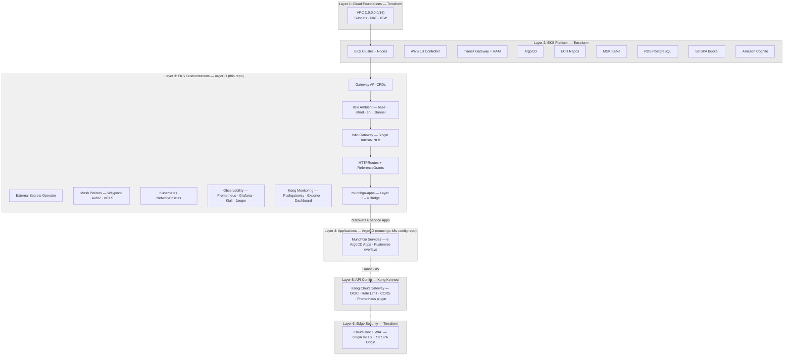

### Step 1: Configure Konnect Credentials

```bash
cp .env.example .env
```

Edit `.env` — only **5 values** needed to start:

```bash
AWS_PROFILE="your-aws-profile"
KONNECT_REGION="au"                   # us, eu, or au
KONNECT_TOKEN="kpat_your_token_here"  # from cloud.konghq.com → Settings → PAT
KONNECT_CONTROL_PLANE_NAME="MunchGo"
ARGOCD_GH_TOKEN="ghp_your_token"      # GitHub PAT (repo + workflow scopes)
```

> `.env` is **gitignored** — your token never gets committed. All scripts auto-source it. The `KONNECT_CP_ID` is resolved and written automatically from Terraform state.

**`ARGOCD_GH_TOKEN`** is used for: (1) ArgoCD credential template to access the private `munchgo-k8s-config` repo, (2) `gh` CLI operations to update GitHub repo variables and trigger CI workflows. Generate at [GitHub → Settings → Tokens](https://github.com/settings/tokens) with `repo` + `workflow` scopes.

**Token in CI/CD:** The same `KONNECT_TOKEN` GitHub Actions secret is used by both the `deck gateway sync` workflow and Terraform (`TF_VAR_konnect_token`). No separate secrets needed.

### Step 2: Deploy Infrastructure + GitOps + Konnect

```bash
# Pass KONNECT_TOKEN so Terraform creates the Konnect control plane + network + data plane group
export TF_VAR_konnect_token="$(grep KONNECT_TOKEN .env | cut -d'"' -f2)"
export TF_VAR_konnect_region="au"

terraform -chdir=terraform init
terraform -chdir=terraform apply
```

Creates **all layers in one shot:**
- **AWS infrastructure:** VPC, EKS cluster + node groups, AWS LB Controller, Transit Gateway + RAM share, ECR (6 repos), MSK (Kafka), RDS (PostgreSQL), S3 (SPA bucket), Amazon Cognito (User Pool, App Client, Groups, Pre Token Lambda, Secrets Manager)
- **Kong Konnect (IaC):** Control plane `MunchGo`, Cloud Gateway Network, and Data Plane Group — managed declaratively via the `kong/konnect` Terraform provider ([terraform/konnect.tf](terraform/konnect.tf)). The CP ID is written to Terraform state and surfaced as `terraform output konnect_control_plane_id`. Transit Gateway attachment requires the network to reach `ready` state (~30 min) and runs separately in Step 4.
- **GitOps:** ArgoCD + root application (App of Apps bootstrapped automatically)

ArgoCD immediately begins syncing all Layer 3 child apps via sync waves. The `09-munchgo-apps.yaml` bridge (wave 8) discovers Layer 4 service Applications from the `munchgo-k8s-config` GitOps repo.

> CloudFront + WAF (Layer 6) is deployed automatically by `03-post-terraform-setup.sh` — the Kong proxy domain is auto-discovered from the Konnect API.

### Step 3: Configure kubectl

```bash
aws eks update-kubeconfig \
  --name $(terraform -chdir=terraform output -raw cluster_name) \
  --region ap-southeast-2 \
  --profile your-aws-profile
```

### Step 4: Attach Transit Gateway (after network is ready)

The Cloud Gateway Network created by `terraform apply` takes **~30 minutes** to reach `ready` state. Once ready, run the TGW attachment script — it polls the Konnect API until the network is confirmed ready then attaches automatically:

```bash
./scripts/02-setup-cloud-gateway.sh --tgw-only
```

This looks up the existing control plane and network (created by Terraform), shares the Transit Gateway via AWS RAM, and attaches it. The script exits cleanly if the TGW is already attached (idempotent).

> **`KONNECT_CP_ID` is zero-touch** — Terraform writes it to state. `03-post-terraform-setup.sh` reads it from `terraform output konnect_control_plane_id` automatically.

### Step 5: Infrastructure Configuration

```bash
./scripts/03-post-terraform-setup.sh
```

Configures all infrastructure after `terraform apply` — idempotent, safe to re-run:

**Config placeholder population:**

| File | What gets populated |
|------|---------------------|
| `deck/kong.yaml` | NLB DNS hostname, Cognito issuer URL |
| `k8s/external-secrets/munchgo-cognito-secret.yaml` | Cognito secret name |
| `k8s/external-secrets/munchgo-db-secret.yaml` | All 7 RDS secret names |
| `munchgo-k8s-config/overlays/dev/auth-service/kustomization.yaml` | Cognito IRSA role ARN |
| `insomnia/munchgo-api.json` | CloudFront `base_url` for automated API tests |

**Automated infrastructure tasks:**

| Task | What it does |
|------|-------------|
| **Discover Kong proxy domain** | Queries Konnect API for CP endpoint prefix, constructs proxy domain, updates `terraform.tfvars`, runs targeted `terraform apply` for CloudFront |
| **ArgoCD repo credentials** | Creates credential template secret for private `munchgo-k8s-config` repo (uses `ARGOCD_GH_TOKEN` from `.env`) |
| **VPC route verification** | Checks AWS route tables for Kong CIDR route, recreates via `terraform apply -replace` if missing |
| **Gateway TLS certificates** | Generates self-signed CA + server cert and creates `istio-gateway-tls` K8s secret for the Istio Gateway HTTPS listener (port 443) — required for Kong → NLB connectivity |
| **Service databases** | Creates PostgreSQL databases for all 6 microservices on RDS |
| **Kafka config secret** | Creates K8s secret from MSK bootstrap brokers |
| **Kong route sync** | Syncs routes/services/plugins to Konnect via `deck gateway sync` |
| **Konnect token secret** | Creates `konnect-token` K8s secret for the analytics exporter CronJob |
| **GitHub CI/CD secrets & variables** | Updates `AWS_ROLE_ARN`, `AWS_REGION`, `SPA_BUCKET_NAME`, `CLOUDFRONT_DISTRIBUTION_ID` (secrets) and `CLOUDFRONT_URL` (variable) in `munchgo-spa` repo — ensures SPA deploy always targets the current stack |

> **CloudFront is mandatory** — WAF rules protect against OWASP Top 10, bot traffic, and DDoS. The CloudFront→Kong origin uses a custom header to prevent bypassing edge security. The proxy domain is auto-discovered — no manual Konnect UI lookup needed.

### Step 6: Application Deployment & Testing

```bash
./scripts/04-deploy-apps.sh                # Full deploy + seed + test
./scripts/04-deploy-apps.sh --skip-seed-data  # Skip demo data seeding
```

Deploys all applications and validates the stack end-to-end:

| Task | What it does |
|------|-------------|
| **Trigger microservices CI** | Dispatches all 6 microservice CI workflows to build and push images to ECR |
| **Trigger SPA deploy** | Dispatches SPA build + S3 deploy + CloudFront invalidation + E2E tests |
| **Wait for CI completion** | Polls GitHub Actions until all microservice workflows finish (~5-8 min) |
| **Wait for SPA deployment** | Polls SPA workflow until build + deploy + E2E completes (~5-10 min) |
| **Wait for pod rollouts** | Monitors K8s deployment rollouts after ArgoCD syncs |
| **Seed admin user** | Creates `admin@munchgo.com` / `Admin@123` in Cognito and auth-service database |
| **Seed demo data** | Populates restaurants and menus via API (optional, skip with `--skip-seed-data`) |
| **Smoke tests** | Curls all service health endpoints via CloudFront, reports pass/fail |

### Step 7: Commit & Push Populated Config

```bash
git add deck/kong.yaml k8s/external-secrets/ insomnia/munchgo-api.json
git commit -m "Populate deployment placeholders from terraform outputs"
git push
```

ArgoCD picks up the ExternalSecret changes and syncs DB credentials to the cluster.

### Access URL

```bash
export APP_URL=$(terraform -chdir=terraform output -raw application_url)
echo "Application URL: $APP_URL"

# Verify connectivity
curl $APP_URL/healthz              # Platform health
curl $APP_URL/api/v1/restaurants   # Public restaurant browsing

# Test with a JWT (authenticated endpoints)
./scripts/02-generate-jwt.sh
curl -H "Authorization: Bearer $ACCESS_TOKEN" $APP_URL/api/v1/orders
```

---

## Verification

```bash
# Istio Ambient components
kubectl get pods -n istio-system
kubectl get pods -n istio-ingress

# Gateway + NLB
kubectl get gateway -n istio-ingress
kubectl get gateway -n istio-ingress kong-cloud-gw-gateway \
  -o jsonpath='{.status.addresses[0].value}'

# HTTPRoutes
kubectl get httproute -A

# MunchGo services
kubectl get pods -n munchgo
kubectl get svc -n munchgo

# Mesh policies
kubectl get peerauthentication -n munchgo
kubectl get authorizationpolicy -n munchgo

# External Secrets (all synced, no errors)
kubectl get externalsecret -n munchgo

# NetworkPolicy enforcement agent (look for 2/2 READY)
kubectl get pods -n kube-system -l k8s-app=aws-node
kubectl get networkpolicies -n munchgo

# Kong monitoring
kubectl get cronjob konnect-analytics-exporter -n observability
kubectl get secret konnect-token -n observability
kubectl logs -n observability -l app=konnect-analytics-exporter --tail=20

# ArgoCD sync status
kubectl get applications -n argocd
```

---

## Observability

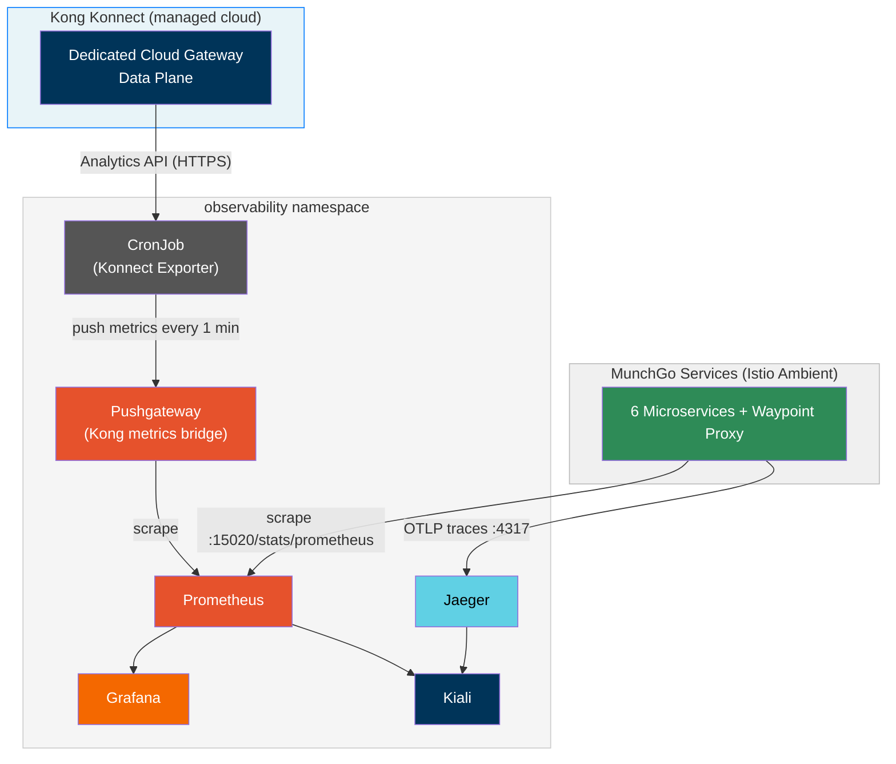

### Grafana, Prometheus & Tracing

| Tool | Port-Forward Command | URL | Credentials |
|------|---------------------|-----|-------------|
| **Grafana** | `kubectl port-forward svc/prometheus-grafana -n observability 3000:80` | http://localhost:3000 | admin / admin |
| **Prometheus** | `kubectl port-forward svc/prometheus-kube-prometheus-prometheus -n observability 9090:9090` | http://localhost:9090 | — |
| **Kiali** | `kubectl port-forward svc/kiali -n observability 20001:20001` | http://localhost:20001 | — |
| **Jaeger** | `kubectl port-forward svc/jaeger-query -n observability 16686:16686` | http://localhost:16686 | — |

**Accessing Grafana step by step:**

```bash
# 1. Port-forward Grafana
kubectl port-forward svc/prometheus-grafana -n observability 3000:80

# 2. Open http://localhost:3000 in your browser
#    Username: admin
#    Password: admin

# 3. Go to Dashboards → Browse to see all available dashboards
#    The Kong Konnect dashboard is auto-loaded (search "Kong Konnect")
#    Istio dashboards need a one-time import — see next section
```

**Useful PromQL queries** (Prometheus at `http://localhost:9090`):

```
kong_konnect_requests_total          — Kong request count by service
kong_konnect_request_latency_ms_p99  — P99 gateway latency
istio_requests_total                 — Istio mesh request count
container_cpu_usage_seconds_total    — Pod CPU
```

### Istio Dashboards

Grafana comes with Prometheus and the Kong dashboard pre-wired, but **Istio dashboards are not pre-loaded** — you import them once from grafana.com. They connect to the `istio_*` metrics that Prometheus is already scraping from ztunnel and the waypoint proxy at `:15020/stats/prometheus`.

**How to import (one-time, takes ~2 minutes):**

1. Open Grafana → `http://localhost:3000`
2. Click **Dashboards** in the left sidebar → **New → Import**
3. Paste one of the IDs below into the **"Import via grafana.com"** box → click **Load**
4. Select **Prometheus** as the data source → click **Import**
5. Repeat for each dashboard you want

| Dashboard | ID | What it shows | Start here? |
|-----------|----|---------------|-------------|
| **Istio Mesh** | `7639` | All services — request rate, error rate, latency across the whole mesh | ✓ Start here |
| Istio Service | `7636` | Drill into one service — inbound vs outbound, top request paths |  |
| Istio Workload | `7630` | Per-pod metrics — useful when debugging a specific pod |  |
| Istio Control Plane | `7645` | istiod health — config push latency, pilot errors |  |
| Istio Performance | `11829` | ztunnel/waypoint proxy CPU, memory, and connection counts |  |

> **Start with `7639` (Istio Mesh)** — it gives the best high-level view of all MunchGo services talking to each other through the mesh. You'll see request rates and error rates for auth-service, consumer-service, order-service, etc. in one place.

### Kong Konnect Monitoring

Kong's Dedicated Cloud Gateway data plane runs in Kong's managed cloud — its Prometheus metrics port (8100) is unreachable from EKS directly. A push-based pipeline bridges this gap:

```
Konnect Analytics API (HTTPS)
        ↓  CronJob every 1 min (konnect-analytics-exporter)
  Pushgateway:9091  (prometheus-pushgateway in observability ns)
        ↓  Prometheus scrapes
    Prometheus → Grafana: "Kong Konnect — Gateway Metrics" dashboard
```

**Metrics in Grafana:**

| Metric | Description |
|--------|-------------|
| `kong_konnect_requests_total` | Total requests per service/route (last minute) |
| `kong_konnect_4xx_total` | Client errors per service/route |
| `kong_konnect_5xx_total` | Server errors per service/route |
| `kong_konnect_request_latency_ms_p99` | P99 end-to-end gateway latency (ms) |
| `kong_konnect_upstream_latency_ms_p99` | P99 upstream (EKS backend) latency (ms) |

**Dashboard:** Grafana → Dashboards → search **"Kong Konnect"** → *Kong Konnect — Gateway Metrics*

**Setup is fully automated:** `02-setup-cloud-gateway.sh` writes `KONNECT_CP_ID` to `.env` when the control plane is created. `03-post-terraform-setup.sh` reads it (or looks it up from the Konnect API by name if missing) and creates the `konnect-token` K8s secret automatically. ArgoCD deploys the CronJob and Pushgateway. Metrics start flowing within the first minute — zero manual steps.

**Verify the exporter:**

```bash
# CronJob status (runs every minute)
kubectl get cronjob konnect-analytics-exporter -n observability

# Recent job runs
kubectl get jobs -n observability -l app=konnect-analytics-exporter

# Exporter logs
kubectl logs -n observability -l app=konnect-analytics-exporter --tail=50

# Metrics at Pushgateway
kubectl port-forward svc/prometheus-pushgateway -n observability 9091:9091
curl http://localhost:9091/metrics | grep kong_konnect
```

Also check Konnect's built-in analytics at [cloud.konghq.com](https://cloud.konghq.com) → **Analytics → Dashboard** — always available regardless of the EKS exporter.

### Konnect UI

Once deployed, everything is visible at [cloud.konghq.com](https://cloud.konghq.com):

| Feature | Where in Konnect UI |
|---------|-------------------|
| **API Analytics** | Analytics → Dashboard (request counts, latency P50/P95/P99, error rates) |
| **Gateway Health** | Gateway Manager → Data Plane Nodes (status, connections) |
| **Routes & Services** | Gateway Manager → Routes / Services |
| **Plugins** | Gateway Manager → Plugins (Prometheus, OpenID Connect, rate limiting, CORS, transforms) |
| **Control Plane** | Gateway Manager → Control Planes → `MunchGo` (managed by `terraform/konnect.tf`) |
| **Cloud Gateway Network** | Gateway Manager → Networks → `munchgo-eks-network` |

The global **Prometheus plugin** is configured in `deck/kong.yaml` — it enables per-service/route metrics on the data plane, surfaced in Grafana via the Konnect Exporter (see [Kong Konnect Monitoring](#kong-konnect-monitoring)).

### ArgoCD UI

```bash
kubectl port-forward svc/argocd-server -n argocd 8080:80
# Open http://localhost:8080
# Username: admin
# Password:
terraform -chdir=terraform output -raw argocd_admin_password
```

---

## Teardown

```bash
./scripts/destroy.sh
```

> **Always use `./scripts/destroy.sh` — never run `terraform destroy` directly.**
>
> The Transit Gateway attachment is created by the setup script (Step 5) via the Konnect REST API and lives in Kong's AWS account. It is **not tracked in Terraform state**. If you run `terraform destroy` directly, it attempts to delete `aws_ec2_transit_gateway` and the Konnect network concurrently — AWS blocks TGW deletion while Kong's attachment is still active and the destroy fails with a `DependencyViolation`. The script handles the correct sequencing.

Tears down the **full stack** in the correct order:

1. **Delete Istio Gateway** → triggers NLB deprovisioning
2. **Wait for NLB/ENI cleanup** → prevents VPC deletion failures
3. **Delete ArgoCD apps** → cascade removes all workloads
4. **Cleanup CRDs** → removes Gateway API and Istio CRDs
5. **Delete Konnect resources** → `terraform destroy -target` removes CP, network, and DP group in order
6. **Cleanup leftover Kong networks** → deletes ALL remaining networks in the org to prevent quota exhaustion on next rebuild
7. **Wait for Kong's TGW detach** → confirms AWS-side cleanup before TGW is deleted
8. **Terraform destroy** → removes EKS, VPC, TGW, RAM, ECR, MSK, RDS, S3, Cognito, CloudFront + WAF
9. **Cleanup CloudFormation stacks** → safety net for orphaned CFN
10. **Reset deployment placeholders** → resets `deck/kong.yaml`, external-secrets, and Insomnia configs back to `PLACEHOLDER_*` values for the next rebuild
11. **Cleanup stale `.env` values** → removes `KONNECT_CP_ID` (will be re-resolved on next deploy)

After teardown, re-running the deployment steps creates a fresh environment — all config files are pre-reset to placeholders and ready for `03-post-terraform-setup.sh` to populate.

---

## Terraform Variables Reference

| Variable | Default | Description |
|----------|---------|-------------|
| `region` | `ap-southeast-2` | AWS region |
| `environment` | `poc` | Environment name |
| `project_name` | `kong-gw` | Project name prefix |
| `vpc_cidr` | `10.0.0.0/16` | VPC CIDR block |
| `kubernetes_version` | `1.29` | EKS Kubernetes version |
| `eks_node_instance_type` | `t3.medium` | System node instance type |
| `user_node_instance_type` | `t3.medium` | User node instance type |
| `enable_ecr` | `true` | Create ECR repositories |
| `enable_msk` | `true` | Create MSK Kafka cluster |
| `msk_instance_type` | `kafka.m5.large` | MSK broker instance type |
| `msk_broker_count` | `2` | Number of Kafka brokers |
| `enable_rds` | `true` | Create RDS PostgreSQL |
| `rds_instance_class` | `db.t3.medium` | RDS instance class |
| `rds_multi_az` | `false` | Multi-AZ for production |
| `enable_spa` | `true` | Create S3 SPA bucket |
| `enable_external_secrets` | `true` | External Secrets IRSA |
| `enable_cognito` | `true` | Amazon Cognito User Pool + IRSA |
| `enable_cloudfront` | `true` | CloudFront + WAF |
| `kong_cloud_gateway_domain` | `""` | Kong proxy domain (from Konnect) |
| `enable_waf` | `true` | WAF Web ACL |
| `waf_rate_limit` | `2000` | Requests per 5 min per IP |
| `konnect_token` | `""` | Konnect PAT — set via `TF_VAR_konnect_token` (sensitive, never hardcode). When set, Terraform creates the control plane, network and data plane group via the `kong/konnect` provider. |
| `konnect_region` | `au` | Konnect control plane geo (`us`, `eu`, `au`) |
| `konnect_control_plane_name` | `MunchGo` | Name of the Konnect control plane to create |

---

## Appendix

### CloudFront Origin mTLS — Terraform Workaround

**Problem:** The Terraform AWS provider (as of v6.31) does **not** support `origin_mtls_config` on the `aws_cloudfront_distribution` resource.

**Workaround:** The CloudFront distribution is created via `aws_cloudformation_stack` instead of the native resource, which supports `OriginMtlsConfig` with `ClientCertificateArn`.

See: [`terraform/modules/cloudfront/main.tf`](terraform/modules/cloudfront/main.tf)

**Migration path** (once Terraform provider adds support):
1. Replace `aws_cloudformation_stack.cloudfront` with native `aws_cloudfront_distribution`
2. `terraform state rm` + `terraform import`
3. Delete orphaned CloudFormation stack
